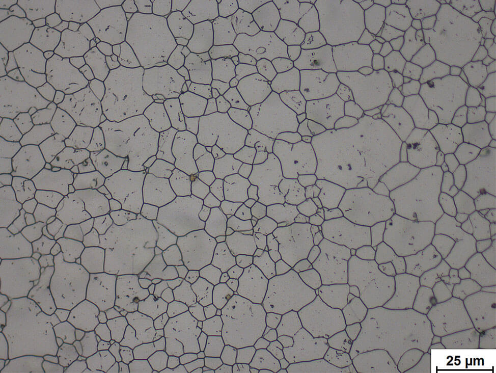

```{r setup, include=FALSE}
knitr::opts_chunk$set(echo = TRUE)
```


# Motivation

In der materialwissenschaftlichen Betrachtung von Werkstücken und deren Eignung für gegebene Anwendungsgebiete ist eine möglichst detaillierte Beschreibung und Charakterisierung derer Eigenschaften eine zentrale Voraussetzung. Je genauer ein Werkstück in seinen Eigenschaften beschrieben werden kann, desto besser kann das Verhalten untersucht und vorhergesagt werden[@askelandMaterialwissenschaftenGrundlagenUbungen1996].

Diese Eigenschaften können in verschiedenen Größenordnungen bestimmt und zur Beantwortung unterschiedlicher Fragen genutzt werden. 
Die erste mögliche Auflösung ist die Beschreibung der atomaren Zusammensetzung des Werkstücks, sowie dem Verhältnis verschiedener Atome zueinander, sollte mehr als ein Element enthalten sein. Aussagen auf dieser Ebene können zum Beispiel Auskunft über elektrische und magnetische Eigenschaften des Werkstücks ermöglichen [@askelandMaterialwissenschaftenGrundlagenUbungen1996].
Als nächste Auflösungsstufe kann die Anordnung dieser Atome zueinander betrachtet werden. Diese meistens in einem Kristallgitter vorliegende Struktur kann Aussagen über zum Beispiel die Festigkeit eines Metalls liefern.
In einem Werkstück liegen verschiedene Kristalle in verschiedenen Gitterzusammensetzungen vor, die auch als Körner bezeichnet werden.
Der Verbund dieser Körner ist dann die nächste mögliche Betrachtungsebene, die auch als Mikrostruktur bezeichnet wird. Die Orientierung der Kristalle zueinander und in Bezug zur Ausrichtung des Werkstückes zusammen mit der Größe und Form der Kristallite spielt eine weitere große Rolle zum Beispiel im mechanischen Verhalten eines Materials.

Die Charakterisierung dieser Mikrostruktur ist die Aufgabe des Ausbildungsberufs des Metallographen. Diese Fachkräfte werden zum Beispiel in Stahlwerken eingesetzt, wo sie das Gefüge der im Material vorhandenen Kristalle durch Politur und Ätzung sichtbar machen. Diese Verfahren werden eingesetzt, um die Grenzen zwischen Körnern, die natürlicherweise Gitterfehler und damit Schwachpunkte des Materials darstellen, sichtbar zu machen. Da der Gitterverbund an diesen Grenzen schwächer ist, werden Atome hier leichter von Säuren ausgelöst, was zu einem mit einem Lichtmikroskop darstellbaren Höhenunterschied zwischen Korn und Korngrenze führt [@GefugeWerkstoffkunde2021]. Ein Beispiel für ein so behandeltes Werkstück ist in Abbildung \@ref(fig:baseGrain) zu sehen. 

(ref:caption1) Lichtmikroskopische Aufnahme von poliertem und geätztem Austenitischem Stahl, Bild von @MetallographieRostfreiemStahl.

```{r baseGrain, echo = F, fig.cap='(ref:caption1)', fig.align='center', out.width='.8\\textwidth'}

```


Um diese Aufnahmen der Schnittbilder zu nutzen, um zu einer quantitativen Beschreibung des Materials zu kommen, wurde traditionell und auch mitunter bis heute eins der vielen "Linienschnittverfahren" eingesetzt, wie es zum Beispiel bei @heynShortReportsMetallurgical1903 beschrieben und als Richtlinienverfahren von der Standardisierungsorganisation ASTM international empfohlen wird [@StandardTestMethods].
Neben diesem gibt es noch andere Ansätze zum Durchführen der Linienschnitte, alle diese Verfahren haben aber das folgende generelle Verfahren gemeinsam:
Zuerst wird auf eine je nach Verfahren festgelegten Vorgehensweise eine Reihe von Linien in die Aufnahme vom Lichtmikroskop gezeichnet. Diese Linien werden dann genutzt, um die Körner auszuzählen und/oder zu vermessen, die von der Linie geschnitten werden. 
Die daraus resultierende Stichprobe an im Werkstück vorhandenen Korngrößen wird abschließend mithilfe einer passenden mathematischen Funktion (z.B. einer log-normalen Verteilungsfunktion) beschrieben, deren Parameter dann als Beschreibung der Kornstruktur genutzt werden.

Neben der verständlichen Ermüdung, die der Bearbeiter bei dieser Methode erfährt, ist die Genauigkeit der Methode grundsätzlich nur approximativ. Daher ist nicht verwunderlich, dass es in diesem Bereich schon Ansätze zur Automatisierung der Materialbeschreibung gibt.
Hier wurde bereits über verschiedene Computervision-Methoden [z.B.: @ananyevCuGdCodoped2014; @heilbronnerAutomaticGrainBoundary2000] und Machine-Learning-Ansätze [z.B.: @decostHighThroughputQuantitative2019; @dengizGrainBoundaryDetection2005] versucht, die Korngrenzen zu extrahieren oder auch die Materialen zu klassifizieren [@abouelattaClassificationCopperAlloys2013].

Diese Verfahren funktionieren gut zur Segmentation von mit Lichtmikroskopie gewonnenen Kornbildern, die durch Ätzung gut darstellbare Korngrenzen aufweisen.
Da mit dem Fortschritt in der Materialtechnik Körner auf immer kleineren Skalen vorliegen, gewinnt die Anwendung höher auflösender mikroskopischer Verfahren aber zunehmend an Wichtigkeit. Der hier nötige Übergang zur Elektronenmikroskopie stellt die automatische Auswertung der Schnittbilder vor neue Probleme. Zwar können bei ätzbaren Oberflächen die oben genannten automatischen Auswertungsmethoden weiter eingesetzt werden, bei besonders kleinen Körnern führt die Ätzung aber zu einem dermaßen Angriff der Kornstruktur, dass eine Identifikation und Detektion der Grenzen geradezu unmöglich wird.
Stattdessen werden die Körner über ihre je nach kristallographischer Orientierung unterschiedlich starke Beugung der Elektronen im Rückstreubild in unterschiedlichen Graustufen dargestellt. Diese Graustufenbilder machen das Identifizieren der Korngrenzen ungemein schwieriger. Beispiele für solche Aufnahmen sind in Abbildung \@ref(fig:electroGrain) zu sehen.

(ref:caption) Elektronenmikroskopische Aufnahmen von Werkstücken. In rot sind die Linien eingezeichnet, die zur Bestimmung der Kornverteilung mit Hilfe eines Linienschnittverfahrens eingesetzt wurden. Das Werkstück links weist wenig Artefakte und klar zu erkennende Kornflächen auf. Rechts ist ein Werkstück abgebildet, dessen Körner weniger deutlich zu erkennen sind, das Gradienten von Grautönen in einem Korn aufweist und dessen Aufnahme deutliche Bildartefakte produziert hat.

```{r electroGrain, echo = F, fig.cap='(ref:caption)',fig.align='center',out.width='.45\\textwidth', fig.show='hold'}
knitr::include_graphics(c('imgs/out1.png',
                          'imgs/out2.png'))
```

Zusätzlich stören Kristalldefekte, Oberflächenartefakte und Spannungen im Material die Auswertung, da sie zu überlagernden Kontrastartefakten führen (Abbildung \@ref(fig:electroGrain) rechts).
Mit Training sind menschliche Bearbeiter zwar weiter in der Lage, Körner und ihre Grenzen zu detektieren und mit Linienschnittverfahren auszuwerten, bestehende Ansätze zur automatischen Detektion von Korngrenzen scheitern aber.

Die Masterarbeit soll an diesem Punkt ansetzen und versuchen das Problem durch Auswertung der Kornflächen statt der Korngrenzen zu lösen.

# Geplantes Vorgehen

In Kollaboration mit der Georg-August-Universität Göttingen soll bereits von menschlichen Bearbeitern ausgewertetes Bildmaterial genutzt werden, um ein Tool zur Unterstützung in der Auswertung zu generieren.
Dieses Tool soll die Auswertung der Bilder dadurch unterstützen, dass statt der Korngrenzen die Fläche der Körner zu erkennen versucht wird.
Da die zu untersuchenden Bilder reich an Artefakten, Bildrauschen und niedrigen Kontrastgradienten sind, soll in einem ersten Schritt eine individuell einzustellende Preprocessing-Pipeline implementiert werden, in der typische Algorithmen zur Kontrastvergrößerung (z.B. Histogram-Equalizer)und Rausch-Minderung (z.B. Gauss-Filter) nach eigenen Vorstellungen kombinierbar sind.
Die so vorbereiteten Bilder sollen dann mit verschiedenen Cluster-Algorithmen (z.B. hierarchische Cluster, DBSCAN,...) analysierbar sein, die versuchen sollen Flächen im Bild zu detektieren.
Durch das Manipulieren der Cluster-Parameter soll es dem Nutzer ermöglicht werden, die Körner möglichst gut zu segmentieren und so ein Linienschnitt-Verfahren und die daraus resultierende Ermüdung der bearbeitenden Person und deren Inkonsistenz zu vermeiden. 

Sollte das Cluster-basierte Vorgehen vielversprechende Resultate liefern, soll die Einstellung der Cluster-Parameter im nächsten Schritt automatisiert werden. Dazu sollen die Ergebnisse der menschlichen Auswertung herangezogen werden, um mit Hilfe von einfachem Grid-Search oder ähnlichen Greedy-Algorithmen eine Approximation der Korn-Verteilung zu ermöglichen.

Dieser Ansatz soll abschließend mit einem Deep Convolutional Network verglichen werden, dass auf Basis der zur Verfügung gestellten Bilder trainiert werden soll, um für ein gegebenes Bild die Parameter der die Verteilung der Korngrößen ähnlichsten Log-Normalen Verteilung auszugeben.

Das in Python zu implementierende Tool soll über eine grafische Oberfläche verfügen, die die Suche nach Clustern und den Einsatz von Filter-Algorithmen vereinfachen soll.
Da das Tool eventuell neue Algorithmen zur Vorverarbeitung und Auswertung unterstützen können soll, ist wichtig, dass eine möglichst einfache Erweiterung gewährleistet wird.
Im Besten Fall soll nur die Ergänzung zum Beispiel des Preprocessing-Moduls nötig sein, um die Funktionialität in allen weiteren Programmteilen wie z.B. dem GUI einzubinden.

# Zeitplan

Nach Anmeldung der Arbeit soll in zwei Monaten die erste Version des Tools erstellt werden.
Dieses soll dann bereits Unterstützung für eine Reihe von Preprocessing-Methoden, Import und Export von Bildern, eine grafische Oberfläche und Methoden zum Clustern der Flächen unterstützen.

Die folgenden zwei Monate sollen dazu genutzt werden, die automatische Bestimmung der Korngrößen durch das beschriebene neuronale Netz und die Methoden zur Suche der optimalen Cluster-Parameter zu implementieren und in das Tool einzubinden.

Der letzte Monat ist für das Schreiben der Thesis und das Einarbeiten möglicher Wünsche der Georg-August-Universität vorbehalten.

# Literatur
