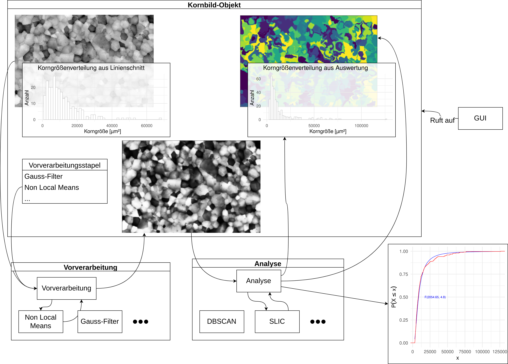

# Design und Entwurf

```{r, include=F, eval = F}
library(tidyverse)
read_csv('../../data/17 0 650 cbs 01_002 results.csv') %>% 
  ggplot(aes(x = Area)) +
  geom_histogram(fill = 'white',
                 color = 'grey',
                 bins = 50) +
  theme_minimal(base_size = 20)+
  labs(x = 'Korngröße [µm²]',
       y = 'Anzahl',
       title = 'Korngrößenverteilung aus Linienschnitt')
ggsave('../imgs/linien_histogram.png',width = 8, height = 4)

generated <- jsonlite::fromJSON('data/17 0 650 cbs 01_002_results.json') %>% 
  nth(3) %>% 
  as.data.frame()

options(scipen = 999)
generated %>% 
  ggplot(aes(x = size)) +
  geom_histogram(fill = 'white',
                 color = 'grey',
                 bins = 80) +
  theme_minimal(base_size = 20)+
  labs(x = 'Korngröße [µm²]',
       y = 'Anzahl',
       title = 'Korngrößenverteilung aus Auswertung')
ggsave('../imgs/tool_histogram.png',width = 8, height = 4)
options(scipen = NULL)

pars <- last(nth(jsonlite::fromJSON('data/17 0 650 cbs 01_002_results.json'),2))
generated %>%
  ggplot(aes(size)) + 
  stat_function(fun = ~pf((. - pars$loc)/pars$scale, df1 = pars$dfn, df2=pars$dfd), color = 'blue') +
  stat_ecdf(geom = 'step', color = 'red') +
  theme_minimal(base_size = 20) +
  annotate(x = quantile(generated$size,.92), y = .5, geom = 'text', color = 'blue', label = glue::glue('F({round(pars$dfn,2)}, {round(pars$dfd,2)})')) +
  labs(x = 'x',
       y = expression(P(X <= x)))
ggsave('../imgs/tool_cdf.png',width = 6, height = 6)


```


Das Tool soll unter der grafischen Oberfläche eine Reihe von Features anbieten. Dies sind zum einen Lösungen für Daten-Handling (Import von Kornbildern und Linienschnitt-Ergebnissen, Export von Resultaten), dann Vorverarbeitungs-Schritte und zuletzt die eigentliche Korn-Detektion. Das Tool soll deshalb in vier Modulen aufgebaut werden:

1. Einem Kornbild-Modul, das eine Klasse zur Abbildung der Kornbilder und je ein Interface zur Vorverarbeitung und Auswertung bietet.
2. Einem Vorverarbeitungs-Modul, das leicht erweiterbar die Vorverarbeitungen in einem möglichst einheitlichen Interface definiert.
3. Einem Analyse-Modul, das auch leicht erweiterbar wieder mit einem einheitlichen Interface Analysemethoden definiert.
4. Einem GUI-Modul, das die Darstellung der Kornbilder, der Korngrößen und die Interaktion mit dem Kornbild ermöglicht.

In Abb. \@ref(fig:designGraph) ist das geplante Tool-Design zur Abbildung der Anforderungen an einem Beispiel dargestellt.

(ref:designGraphSubCap) Illustration des Tool-Designs.

(ref:designGraphCap) Illustration des Tool-Designs. 

```{r designGraph, echo = F, fig.cap='(ref:designGraphCap)', fig.align='center',out.width=paste0(.96/1,'\\textwidth'), fig.show='hold', fig.scap='(ref:designGraphSubCap)'}

```

Die von Objekten der Kornbild-Klasse aufrufbaren Interfaces zu den Analyse- und Vorverarbeitungsmodulen sollen dabei über je eine zentrale Funktion ablaufen, die die jeweiligen Auswertungs- oder Vorverarbeitungsschritte bei Weiterreichen der gegebenen Argumente als Unterfunktionen aufrufen. So kann zur Erweiterung des Funktionsumfangs einfach im entsprechenden Modul eine Funktion hinzugefügt und der zentrale Wrapper erweitert werden, ohne dass das Kornbild-Modul angepasst werden muss. Solange die Funktionen dabei in einem standardisierten System benannt und dokumentiert werden, können die Funktionsumfänge der Analyse- und Vorverarbeitungsmodule dann auch zur flexiblen Erstellung von GUI-Schaltflächen genutzt werden, so dass auch hier bei einer Erweiterung des Funktionsumfangs ein Minimum an Anpassungen nötig wird.\newline
Objekte der Kornbild-Klasse sollen außerdem Methoden zum Einlesen der vom Elektronenmikroskop gelieferten .tif-Bilder und der etwaig vorliegenden Linienschnitt-Auswertungen liefern. Für beide Inhalte muss je ein Attribut in der Klasse vorgehalten werden. Um verschiedene Auswertungsschritte und -reihenfolgen ausprobieren zu können, muss für Bilder und Korngrößen-Verteilung außerdem je ein Attribut für die veränderten und ausgemessenen Größen angelegt werden.\newline
Da bei der Vorverarbeitung die Reihenfolge der angewandten Algorithmen entscheidend ist, sollen die geplanten Vorverarbeitungen außerdem nicht einfach bei Aufruf ausgeführt werden, sondern in Form eines Stapels geplant und dann auf Wunsch hintereinander ausgeführt werden. Ein Beispiel für den Einfluss der Reihenfolge der Vorverarbeitung ist in Abb. \@ref(fig:prepOrder) zu sehen. Auch dieser Stapel muss in der Kornbild-Klasse als Attribut angelegt werden. 

(ref:prepOrderSubCap) Einfluss der Vorverarbeitungs-Reihenfolge.

(ref:prepOrderCap) Einfluss der Vorverarbeitungs-Reihenfolge. Links ist zuerst ein Histogramm-Equalizer, dann ein Gauss-Filter angewandt worden, rechts dieselben Filter in umgekehrter Reihenfolge. Der Gauss-Filter hat mit seiner Kernelgröße von $\approx$ 10% der Bildgröße eine relativ extreme Einstellung, der Effekt der Reihenfolge ist aber deutlich zu erkennen.

```{r prepOrder, echo = F, fig.cap='(ref:prepOrderCap)', fig.align='center',out.width=paste0(.96/2,'\\textwidth'), fig.show='hold', fig.scap='(ref:prepOrderSubCap)'}
knitr::include_graphics(c('../imgs/gauss_hist.png', 
                          '../imgs/hist_gauss.png'), dpi = 300) 
``` 

Für die Analyse- und Vorverarbeitungsmodule gilt ein zentrales Design-Prinzip:

Das Ziel der Aufrufbarkeit der Verarbeitungsschritte über eine zentrale Funktion heißt im Detail, dass alle Verarbeitungsfunktionen zum einen möglichst ähnliche Interfaces, zum anderen dasselbe Outputformat aufweisen müssen. Im Idealfall sollten die einzelnen Verarbeitungsschritte jeweils in eine feste Pipeline integriert werden, um Lesbarkeit und Erweiterbarkeit der Lösungen zu verbessern.\newline
Alle Vorverarbeitungsschritte, die bisher durch das Institut für Materialwissenschaften standardmäßig eingesetzt werden, sollten in das Vorverarbeitungsmodul integriert werden. Für das Analysemodul sollen die in den Grundlagen diskutierten, vielversprechenden Superpixel-Methoden implementiert werden. Außerdem soll das Analysemodul für eine gegebene empirische Korngrößen-Verteilung die Möglichkeit bieten, eine Verteilungsfunktion anzupassen und die Verteilungsparameter zurückzugeben.\newline
Als letzter zu beschreibender Punkt bleibt die GUI. Neben dem Zugriff auf die oben genannten Funktionen zur Datenverarbeitung, stapelweisen Vorverarbeitung und der Analyse sollte die GUI über Grafiken Feedback zum vorliegenden Bild, dem Ergebnis der (Vor-)verarbeitung und der händischen oder ausgemessenen Korngrößen-Verteilungen bieten. Es ist also ein Kontroll-Bereich zur vollständigen Nutzung und Steuerung der Funktionalität und ein Feedback-Bereich mit grafischen Darstellungen der Verteilungs- und Bildattribute des Kornbild-Objekts einzuplanen.