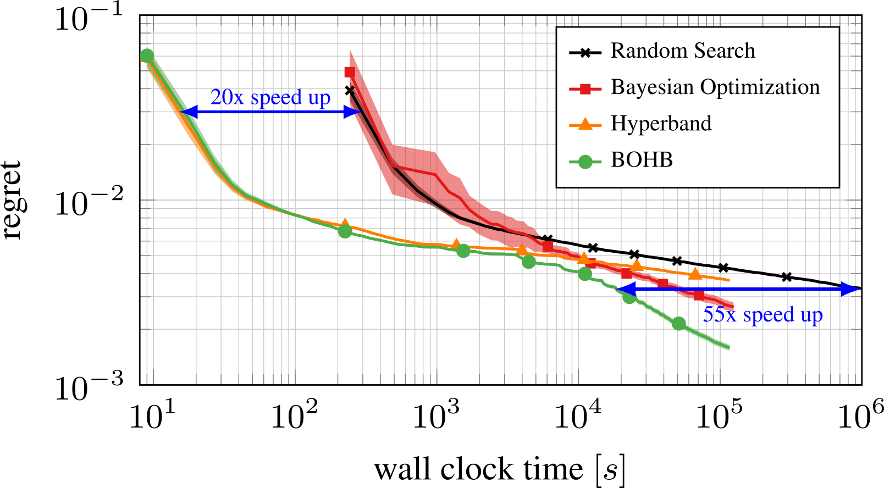

# Grundlagen

Dieses Kapitel beschäftigt sich zuerst mit den zur Bildvorbereitung betrachteten und verwendeten Algorithmen. Darauf folgt eine Beschreibung der getesteten Ansätze zur Flächen-Gruppierung, um dann dazu überzugehen, die Implementation des Körner-Tools zu beschreiben.
Im Anschluss werden die notwendigen Ansätze zur Extraktion der Kornstrukturen und ihrer Automatisierung erklärt.


## Bildvorverarbeitung

Im Folgenden werden die einzusetzenden Vorverarbeitungsalgorithmen beschrieben. Da das Augenmerk dieser Arbeit insbesondere auf der Erkennung von Körnern und weniger auf dem Vorverarbeiten liegen soll, stehen an dieser Stelle die bereits in der Kornvermessung eingesetzte Algorithmen im Vordergrund der Betrachtung.
Alle diese Vorverarbeitungs-Schritte verfolgen zwei Ziele: 
Zum einen soll versucht werden, die Bildartefakte so gut wie möglich zu entfernen, zum anderen sollen die Grautöne innerhalb eines Korns so gut angeglichen werden wie möglich.
Die Reihenfolge, in der die Algorithmen angewandt werden, ist außerdem von entscheidender Bedeutung, ein Histogramm-Equalizer führt nach Anwendung eines Gauss-Filters zu einem deutlich anderen Effekt als davor. Auf diesen Punkt wird aber in der Beschreibung der Implementation noch umfangreicher eingegangen.

```{r, include = F, eval=F}
minmax <- function(x)(x-min(x))/(max(x)-min(x))
n <- 200
p <- tibble(
  x = rep(1:n, times = n),
  y = rep(1:n, each = n),
  color =  case_when(
    y < .25 * n  &  x < .5 * n~  as.integer(round(minmax(sin(sqrt(x^2 + y^2)/3) 
                                                         + .5 * rnorm(n^2))*n)),
    y < .25 * n  &  x >= .5 * n~  as.integer(round(minmax(sin(sqrt(x^2 + y^2)/3) 
                                                         + .5 * rf(n^2,2,23))*n)),
    y < .5 * n ~ as.integer((1 - x %/% (n / 4 + 1) %% 2) * n),
    y < .75 * n ~ as.integer(abs(x - n  - 1)),
    T ~ as.integer(round(minmax(cos(x) * x) * n))
)) %>%
  ggplot(aes(x, y, fill = color, color = color)) +
  geom_tile() +
  coord_equal() +
  theme_void() +
  theme(legend.position = 'none') +
  scale_fill_gradient(low = 'white',
                      high = 'black')+
  scale_color_gradient(low = 'white',
                      high = 'black')

ggsave(plot = p, filename = '../imgs/geometric.png', width = 5, height = 5,bg = 'white')

```

### Gauss-Filter

Gauss-Filter werden häufig in Anwendungsbereichen mit multivariaten Untersuchungsgegenständen eingesetzt, so zum Beispiel in EEG- und fMRT-Analysen [@harishvijeyAutomatedTechniqueEEG2022; @winkDenoisingFunctionalMR2004], in Zeitreihenanalysen [@kitagawaTwofilterFormulaSmoothing1994] und nicht zuletzt weit verbreitet in der Bildverarbeitung [@basuGaussianbasedEdgedetectionMethodsa2002]. 

Bei diesem Verfahren wird das Bild auf Basis einer zweidimensionalen Gauss-Dichte-Funktion gefaltet, wodurch jedes Pixel durch die gewichtete Summe der umliegenden Pixel ersetzt wird. Die dabei als Gewichtung eingesetzte, zweidimensionale Dichte-Funktion wird auch als der *Kernel* bezeichnet. In Abb. \@ref(fig:gaussFilter) ist beispielhaft das Ergebnis eines Gauss-Filters zu sehen. In der Abbildung wird dessen primäre Funktion deutlich. Die harten Kanten des Bildes werden zunehmend weicher mit größerer Kernel-Einstellung, außerdem werden die einzelnen, herausstechenden Pixel im unteren Viertel der Abbildung ihrem Umfeld angeglichen und stechen weniger deutlich hervor.
Dieser auch als Glättungs-Filter bezeichnete Vorverarbeitungs-Algorithmus wird mit dem Ziel eingesetzt, Pixel mit extremen Werten an ihr direktes Umfeld anzugleichen und damit Bildartefakte zu entfernen.

(ref:gaussFilterCap) Beispiel eines Gauss-Filters.

(ref:gaussFilterSubCap) Beispiel eines Gauss-Filters. Links ist das Bild vor dem Filtern, in der Mitte nach dem Filtern mit einem Gausskernel mit Durchmesser von 15 Pixeln (1% der Bildkantenlänge) und rechts einem mit Durchmesser von 151 Pixeln (~10% der Kantenlänge) zu sehen.

```{r gaussFilter, echo = F, fig.cap='(ref:gaussFilterSubCap)', fig.align='center',out.width='.32\\textwidth', fig.show='hold', fig.scap='(ref:gaussFilterCap)'}
knitr::include_graphics(c('../imgs/geometric.png','../imgs/gauss15.png','../imgs/gauss150.png'))
```


### Histogramm-Equalizer

Ein Histogramm-Equalizer gleicht die Helligkeitswerte eines Bildes so an, dass die kumulative Häufigkeitsverteilung der Helligkeitswerte linear ansteigt [@princePartIVPreprocessing2012]. Je nach Bild kann es also passieren, dass Teile der Helligkeitswert-Verteilung gestreckt, andere Teile gestaucht werden. 
Diese nicht-lineare Transformation führt dazu, dass bei nicht-linearen Helligkeitsverteilungen, wie zum Beispiel im Falle eines Bildes mit vielen ähnlichen Grautönen, vorher kleine Unterschiede deutlicher akzentuiert werden, während stark unterschiedliche Helligkeitswerte angenähert werden können.
In Abb. \@ref(fig:histEqual) ist der Effekt des Histogramm-Equalizers beispielhaft dargestellt. Der Farbverlauf im unteren Viertel der oberen Hälfte der Abbildung wurde verdunkelt, genau wie die erste, auf dem Cosinus basierenden Zeile mit Ausnahme einer weißen Spalte. Unter den geometrischen Muster sind die Helligkeitsverteilungen vor und nach der Anwendung des Filters zu sehen, die Linearisierung der Helligkeitsverteilung ist deutlich zu erkennen.

```{r, eval = F, include=F}
p <- c('../imgs/geometric.png') %>% 
  map_dfr(~as.data.frame(imager::load.image(.)),.id = 'image') %>% 
  transmute(value = sort(value),
            p = 1/length(value),
            cs = cumsum(p)) %>% 
  group_by(value) %>% 
  summarise(cs = max(cs, na.rm=T)) %>% 
  ggplot(aes(x = value, y = cs)) +
  geom_point() +
  theme_minimal() +
  xlim(-0.1,1.1) +
  ylim(-0.1,1.1) +
  labs(y = 'Kummulative Häufigkeit',
       x = 'Intensität')


ggsave(plot = p, '../imgs/hist_kum1.png',width = 5, height = 5) # zwei Grafiken wären wohl besser...

p <- c('../imgs/hist_equal.png') %>% 
  map_dfr(~as.data.frame(imager::load.image(.)),.id = 'image') %>% 
  transmute(value = sort(value),
            p = 1/length(value),
            cs = cumsum(p)) %>% 
  group_by(value) %>% 
  summarise(cs = max(cs, na.rm=T)) %>% 
  ggplot(aes(x = value, y = cs)) +
  geom_point() +
  theme_minimal() +
  xlim(-0.1,1.1) +
  ylim(-0.1,1.1) +
  labs(y = 'Kummulative Häufigkeit',
       x = 'Intensität')

ggsave(plot = p, '../imgs/hist_kum2.png',width = 5, height = 5)
```

(ref:histEqualizerCap) Beispiel für die Anwendung eines Histogramm-Equalizers.

(ref:histEqualizerSubCap) Beispiel für die Anwendung eines Histogramm-Equalizers. Links ist das Bild vor, rechts nach der Anpassung der Helligkeitsverteilung zu sehen. Der Farbverlauf wurde verdunkelt, genau wie die erste, auf dem Cosinus basierenden Zeile mit Ausnahme einer weißen Spalte. Unten sind die Helligkeitsverteilungen abgebildet, die Linearisierung ist deutlich zu erkennen.

```{r histEqual, echo = F, fig.cap='(ref:histEqualizerSubCap)', fig.align='center',out.width='.48\\textwidth', fig.show='hold', fig.scap='(ref:histEqualizerCap)'}
knitr::include_graphics(c('../imgs/geometric.png', '../imgs/hist_equal.png'), dpi = 300)
knitr::include_graphics(c('../imgs/hist_kum1.png','../imgs/hist_kum2.png'),dpi = 300)
```

### Non-Local-Mean-Denoiser

Ein Non-Local-Mean Denoiser versucht, Bildrauschen durch das Ersetzen der Grauwerte ähnlich grauer, nicht unbedingt nebeneinander liegender Pixel durch deren Grauwert-Mittelwert zu reduzieren. Dazu wird in einem angegebenen Suchfenster für alle ähnlich grauen Pixel der Mittelwert der Grauwerte als neuer Grauwert gesetzt. Die Pixel müssen dabei explizit nicht lokal nebeneinander liegen, sondern nur einen ähnlichen Grauwert aufweisen [@buadesNonLocalMeansDenoising2011]. 

Der Filter wird dabei über eine Filter-Stärke, die Größe des Suchfensters und die Größe des "Templates", also der Menge an Gruppen als gleich gezählter Pixel, bestimmt.

In Abb. \@ref(fig:nlMeans) ist der Effekt des Denoisers zu sehen, das Bildrauschen im unteren Viertel wird deutlich reduziert, auch wenn das Muster dadurch leicht undeutlich wird. Der Denoiser stößt jedoch an seine Grenzen bei der Entfernung nicht-normalen Rauschens, wie zum Beispiel in der rechten Hälfte der letzten Zeile zu sehen ist. Dort wurde im Gegensatz zur linken Hälfte kein normalverteiltes, sondern F-verteiltes Rauschen auf das Bild addiert. Durch die schiefe Form der F-Verteilung sind so deutlich dunklere Pixel entstanden, die als Ausreißer nicht vom Non-Local-Mean Denoiser entfernt werden, da sie nicht ähnlich genug zu den restlichen Pixeln sind.

(ref:nlMeansSubCap) Beispiel für die Anwedung eines Non-Local_Mean Denoisers.

(ref:nlMeansCap) Beispiel für die Anwedung eines Non-Local_Mean Denoisers. Links ist das Bild, rechts nach dem Denoising mit einer Template-Größe von 7, einem Suchfenster von 21 zu sehen, der Filter wurde verhältnismäßig stark gewichtet um den Einfluss deutlich zu machen. Das Rauschen wurde zwar reduziert, die konzentrischen Kreise aber auch unschärfer.

```{r nlMeans, echo = F, fig.cap='(ref:nlMeansCap)', fig.align='center',out.width=paste0(.96/2,'\\textwidth'), fig.show='hold', fig.scap='(ref:nlMeansSubCap)'}
knitr::include_graphics(c('../imgs/geometric.png', '../imgs/nlMean_30_7_21.png'), dpi = 300)
```


### Savitzky-Golay-Filter
```{r, eval = F, include=F}
p <- c('../imgs/savgol51_1.png') %>% 
  map_dfr(~as.data.frame(imager::load.image(.)),.id = 'image') %>% 
  transmute(value = sort(value),
            p = 1/length(value),
            cs = cumsum(p)) %>% 
  group_by(value) %>% 
  summarise(cs = max(cs, na.rm=T)) %>% 
  ggplot(aes(x = value, y = cs)) +
  geom_point() +
  theme_minimal() +
  xlim(-0.1,1.1) +
  ylim(-0.1,1.1) +
  labs(y = 'Kummulative Häufigkeit',
       x = 'Intensität')

ggsave(plot = p, '../imgs/savgol1.png',width = 5, height = 5)

p <- c('../imgs/savgol51_5.png') %>% 
  map_dfr(~as.data.frame(imager::load.image(.)),.id = 'image') %>% 
  transmute(value = sort(value),
            p = 1/length(value),
            cs = cumsum(p)) %>% 
  group_by(value) %>% 
  summarise(cs = max(cs, na.rm=T)) %>% 
  ggplot(aes(x = value, y = cs)) +
  geom_point() +
  theme_minimal() +
  xlim(-0.1,1.1) +
  ylim(-0.1,1.1) +
  labs(y = 'Kummulative Häufigkeit',
       x = 'Intensität')

ggsave(plot = p, '../imgs/savgol5.png',width = 5, height = 5)

p <- c('../imgs/savgol51_11.png') %>% 
  map_dfr(~as.data.frame(imager::load.image(.)),.id = 'image') %>% 
  transmute(value = sort(value),
            p = 1/length(value),
            cs = cumsum(p)) %>% 
  group_by(value) %>% 
  summarise(cs = max(cs, na.rm=T)) %>% 
  ggplot(aes(x = value, y = cs)) +
  geom_point() +
  theme_minimal() +
  xlim(-0.1,1.1) +
  ylim(-0.1,1.1) +
  labs(y = 'Kummulative Häufigkeit',
       x = 'Intensität')

ggsave(plot = p, '../imgs/savgol11.png',width = 5, height = 5)
```

Ein Savitzky-Golay-Filter wird in allen Bereichen der Signalverarbeitung zur Signalglättung eingesetzt. Hierzu wird eine Fenstergröße und ein Grad für das zu nutzende Polynom festgelegt. Das Verfahren fitted iterativ in je einem Abschnitt in der angegebenen Fenstergröße über die gesamte Zeitreihe eine polynomiale Regression des angegebenen Grades. Das Mittel der Vorhersagen dieser Regressionen über die Datenreihe wird dann zurückgegeben. Je nach Größe des Fensters und der Höhe des Polynoms wird dadurch unterschiedlich stark geglättet.

In Abb. \@ref(fig:savgol) ist der Effekt je eines horizontalen und vertikalen Savitzky-Golay-Filters mit jeweils einer Fenstergröße von 51 Pixeln und einem Polygon der 1., 5. und 11. Ordnung beispielhaft dargestellt. Wie zu sehen ist, schlägt sich der Filter bei Polynomen niedrigeren Grades eher als Unschärfe nieder, je höher die Grade sind, desto mehr Varianz im Signal wird nicht entfernt. Je höher der Grad des Polynoms für den Filter also gewählt wird, desto weniger stark wird das Bild durch den Filter verändert - desto weniger Rauschen wird aber auch entfernt.

(ref:savgolCap) Beispielhafte Darstellung eines Savitzky-Golay-Filters.

(ref:savgolSubCap) Beispielhafte Darstellung eines Savitzky-Golay-Filters. Links ist das Bild vor, rechts nach der Glättung der Helligkeitsverteilung mit einem Polynom 1., 5. und 11. Grades zu sehen. Unten sind die Helligkeitsverteilungen abgebildet.

```{r savgol, echo = F, fig.cap='(ref:savgolSubCap)', fig.align='center',out.width='.24\\textwidth', fig.show='hold', fig.scap='(ref:savgolCap)'}
knitr::include_graphics(c('../imgs/geometric.png', 
                          '../imgs/savgol51_1.png', 
                          '../imgs/savgol51_5.png', 
                          '../imgs/savgol51_11.png'), dpi = 300)
knitr::include_graphics(c('../imgs/hist_kum1.png','../imgs/savgol1.png',
                          '../imgs/savgol5.png','../imgs/savgol11.png'),dpi = 300)
```


## Extraktion der Kornstrukturen 

Der folgende Abschnitt beschäftigt sich mit den möglichen Ansätzen zur Erkennung und Extraktion der Kornflächen. 
<!-- Für einen Überblick über Methoden zur Erkennung von Superpixeln und mögliche Architekturen zur Vermessung von Kornbildern. -->


### DBSCAN

Der ursprünglich zur Gruppierung großer Datenbanken entwickelte *Density-based Spatial Clustering of Applications with Noise* (DBSCAN) Algorithmus [@esterIncrementalClusteringMining1998] konnte bereits erfolgreich zur Superpixel-Segmentierung in Echtzeit eingesetzt werden [@shenRealTimeSuperpixelSegmentation2016]. 

Der DBSCAN-Cluster-Algorithmus überprüft für jeden einzelnen Datenpunkt, wie viele Datenpunkte in einem vorgegebenen Radius $\epsilon$ um den betrachteten Punkt liegen. Das Verfahren sortiert so Datenpunkt für Datenpunkt lokal über den Radius verknüpfte Einträge zusammen, die als zu einem Cluster zugehörig erklärt werden, sobald eine angegebene Mindestanzahl an Samples erreicht ist.

Durch das iterative Vorgehen bei diesem Verfahren ist die Form der erkannten Cluster nicht festgelegt. Dadurch können auch komplexe Formen im Feature-Raum abgebildet werden. Ein weiterer Vorteil ist die geringe Anfälligkeit für Ausreißer, da sich nicht im Radius um andere Punkte befindliche Datenpunkte einfach keinem Cluster zu sortiert werden.

In Abb. \@ref(fig:dbscanExample) ist der Einfluss verschieden großer Radien und Mindest-Clustergrößen dargestellt. Die Werte wurden vor dem Clustern so skaliert, dass x- und y-Achse sowie die Farbwerte des ursprünglichen Bilds zwischen 0 und 100 liegen.

(ref:dbscanExampleSubCap) Beispiel für Ergebnisse des DBSCAN-Algorithmus.

(ref:dbscanExampleCap) Beispiel für Ergebnisse des DBSCAN-Algorithmus. Die Graphen stellen dasselbe Muster dar, wie zur Illustration der Vorverarbeitungsmethoden genutzt wurde. In der ersten Zeile wurde $\epsilon$ auf 1, in der zweiten Zeile auf 2 gesetzt. Oben wurde die Mindestzahl an Pixeln auf 5, unten  auf 10 gesetzt. Die Werte sind so skaliert, x- und y-Achse sowie die Grauwerte des ursprünglichen Bilds zwischen 0 und 100 liegen. Darunter ist das ursprüngliche Bild dargestellt.


```{r dbscanExample, echo = F, fig.cap='(ref:dbscanExampleCap)', fig.align='center',out.width=paste0(.8/2,'\\textwidth'), fig.show='hold', fig.scap='(ref:dbscanExampleSubCap)'}
knitr::include_graphics(c('../imgs/dbscan_1_5.png', '../imgs/dbscan_1_10.png'), dpi = 300)
knitr::include_graphics(c('../imgs/dbscan_2_5.png', '../imgs/dbscan_2_10.png'), dpi = 300)
knitr::include_graphics(c('../imgs/geometric.png'), dpi = 300)
```

```{r, include=F, eval=F}
library(tidyverse)
img <- as.data.frame(imager::load.image('../imgs/geometric.png')) %>% 
  filter(value != 1,
         x %% 5 == 0,
         y %% 5 == 0) %>% 
  select(-cc) %>% 
  mutate(y = max(y) - y,
         across(where(is.numeric), ~100 * (.-min(.))/(max(.)-min(.))))

settings <- expand.grid(seq(1.5,3,.5), seq(5,15,5))
clustered <- lapply(1:9, 
                    \(.x){
                      start = Sys.time()  
                      res = dbscan::dbscan(img, settings[.x,1], settings[.x,2])
                      res$stop = Sys.time() - start
                      return(res)})
res <- map_dfr(clustered, ~mutate(img, cluster = .$cluster, eps = .$eps, minPts = .$minPts, time = .$stop))

p <- res %>% 
  mutate(cluster = ifelse(cluster %in% -1:0, NA, cluster),
         cluster = as.factor(cluster%%8)) %>% 
  ggplot(aes(x,y,color = cluster, fill = cluster)) +
  geom_tile() +
  geom_text(x = 50, y = 102,color = 'black', aes(label=round(time,2))) +
  facet_grid(eps ~ minPts) +
  coord_fixed() +
  theme_minimal()+
  theme(legend.position = 'none') +
  scale_fill_brewer(palette='Dark2')+
  scale_color_brewer(palette='Dark2')

ggsave(filename = '../imgs/dbscan.png',
       width = 12, height = 12, dpi = 150,bg = 'white')
```


### SLIC

Beim als Superpixel-Segmentierungsansatz weit verbreiteten *Simple Linear Iterative Clustering* (SLIC) [@achantaSLICSuperpixelsCompared2012] wird ein k-Means basiertes Verfahren genutzt, um näherungsweise gleich große Superpixel im Bild zu detektieren.
Dabei wird sowohl für den Farb- als auch den Pixelraum je eine euklidische Distanz aller Pixel zueinander berechnet, die dann gewichtet aufsummiert wird. Dabei wird in der Arbeit von @achantaSLICSuperpixelsCompared2012 die räumliche Distanz gewichtet, wodurch mit hohen Werten des Parameters *m* die räumliche Nähe, mit niedrigen Werten die farbliche Nähe stärker gewichtet wird.

Der weitere Algorithmus ist im Prinzip der des normalen k-Means Clustering, das heißt Cluster-Kerne werden definiert (bei SLIC in regelmäßigen Abständen), Pixel werden den nächsten Clustern zugeordnet und die Zentroide dann auf die Zentroide der neuen Cluster verschoben.
Im Gegensatz zum regulären k-Means wird bei SLIC aber nicht im gesamten Datenraum nach möglichen Cluster-Angehörigen gesucht, sondern nur im doppelten Suchraum der vorgegebenen Clustergröße.
@achantaSLICSuperpixelsCompared2012 beschreiben außerdem eine adaptive Version des SLIC, bei dem die Cluster-Größe (und Anzahl) und die Gewichtung von räumlicher und farblicher Distanz clusterweise angepasst wird. Dazu wird in jeder Iteration an der maximalen Distanz der vorhergehenden Iteration normalisiert.
In Abb. \@ref(fig:slicExample) ist ein Beispiel für den ASLIC-Algorithmus mit unterschiedlichen *m*-Gewichten und anfänglicher Cluster-Anzahl zu sehen.

(ref:slicExampleSubCap) Beispiel für eine Superpixel-Segmentierung mit SLIC.

(ref:slicExampleCap) Beispiel für eine Superpixel-Segmentierung mit SLIC. Dargestellt sind die Cluster-Label als Grauschattierung. Links ist die Segmentierung mit 250 Start-Cluster-Zentren, rechts mit 500 dargestellt, oben je mit .05, unten mit 2 als Wert für *m* zu sehen. In beiden Beispielen wurde die Adaptive Version des SLIC-Algorithmus wie bei @achantaSLICSuperpixelsCompared2012 beschrieben eingesetzt. Unter den verarbeiteten Bildern ist das ursprüngliche Bild dargestellt.

```{r slicExample, echo = F, fig.cap='(ref:slicExampleCap)', fig.align='center',out.width=paste0(.8/2,'\\textwidth'), fig.show='hold', fig.scap='(ref:slicExampleSubCap)'}
knitr::include_graphics(c('../imgs/slic_5_250.png', 
                          '../imgs/slic_5_500.png'), dpi = 300) 
knitr::include_graphics(c('../imgs/slic_200_250.png', 
                          '../imgs/slic_200_500.png'), dpi = 300)
knitr::include_graphics(c('../imgs/geometric.png'), dpi = 300)
```


### Normalized Cuts

Beim *Normalized Cuts* Verfahren zur Extraktion von Superpixeln [@shiNormalizedCutsImage2000] wird das Bild in einen Graphen übersetzt, bei dem jeder Pixel durch einen Knoten repräsentiert wird. Jeder dieser Knoten wird dann mit jedem anderen Knoten über eine Kante verbunden, die über ein Maß gewichtet wird, das die Wahrscheinlichkeit der "Zugehörigkeit zu einem Objekt" [@shiNormalizedCutsImage2000] ausdrückt.
Im Orginal-Paper wird die Wahrscheinlichkeit durch eine gewichtete Exponential-Funktion mit den Kontrastwerten und den geometrischen Distanzen im Exponenten ausgedrückt. Für beide Werte ist je eine Gewichtung vorgesehen, die angepasst werden kann - außerdem ein maximal zu berücksichtigender Radius für den geometrischen Abstand.

Unabhängig von der genauen Gewichtung der Kanten wird anschließend derjenige Schnitt gesucht, der die geringste Summe an Kantengewichten "durchtrennt". Dieser *Normalized Cut* wird so bestimmt, dass die durch den Schnitt getrennten Gruppen möglichst unterschiedlich und die verbleibenden Gruppen in sich möglichst homogen sind.  Die Lösung dieses Problem für ein ganzes Bild kann sehr aufwendig sein, weswegen zur Optimierung nur im geometrischen Umfeld der betrachteten Knoten gesucht wird.
Statt die Kanten mit der Wahrscheinlichkeits-Formel aus dem Papier von @shiNormalizedCutsImage2000 zu gewichten, können auch beliebige andere Gewichte gesetzt werden. So ist in der Implementation von NCuts, die in der Dokumentation des scikit-image-Python-Moduls[@NormalizedCutSkimage] präsentiert wird, der Graph mit den Ergebnissen einer SLIC-Voranalyse gewichtet. Vor allem bei großen Bildern wird die von @shiNormalizedCutsImage2000 präsentierte Berechnung nahezu unmöglich, ohne große Optimierung ist allein eine Ergebnis-Matrix mit mindestens $\frac{N_{Pixel}^2}{2}$ Einträgen nötig.
Da SLIC aber in gewisser Form auch eine \glqq{}Wahrscheinlichkeit der Zugehörigkeit zum selben Objekt" abdeckt und besonders bei großen Bildern die Findung einer Lösung für den optimalen Schnitt aufwendig wird, ist die Vorverarbeitung in diesem Sinne eine sinnvolle Optimierungs-Option.
Bei der Findung der optimalen Lösung können eine Reihe von Einstellungen gesetzt werden. Neben den Einstellungen für die SLIC-Vorsegmentierung kann die Anzahl der gesuchten Schnitte, die maximale Distanz zwischen zwei Farben, um als ähnlich erkannt zu werden, und zuletzt der minimale Wert, den ein Schnitt haben darf, um durchgeführt zu werden.

In Abb. \@ref(fig:ncutsClassic) sind Beispiele für NCuts-Anwendungen mit unterschiedlichen Einstellungen zu sehen.

(ref:ncutsClassicSubCap) Beispiel für eine Superpixel-Segmentierung mit NCuts

(ref:ncutsClassicCap) Beispiel für eine Superpixel-Segmentierung mit NCuts mit vorgeschalteter SLIC-Segmentierung. Die SLIC-Segmentierung wurde mit .05 als geometrisches Gewicht und 2000 Start-Clustern durchgeführt. In der oberen Zeile wurde der minimale Schnittwert auf .001, in der unteren Zeile auf .5 gesetzt. Die linken Bilder wurden mit 10, die rechten mit 100 Schnitten geteilt. Zusätzlich sind die Bilder links oben und recht oben mit einer maximalen Farbdistanz von 20, die anderen beiden mit je 100 erstellt. Unter den verarbeiteten Bildern ist das ursprüngliche Bild dargestellt.


```{r ncutsClassic, echo = F, fig.cap='(ref:ncutsClassicCap)', fig.align='center',out.width=paste0(.8/2,'\\textwidth'), fig.show='hold', fig.scap='(ref:ncutsClassicSubCap)'}
knitr::include_graphics(c('../imgs/ncuts_5_2000_1.0_10_20.png', 
                          '../imgs/ncuts_5_2000_1.0_100_100.png'), dpi = 300) 
knitr::include_graphics(c('../imgs/ncuts_5_2000_500.0_10_100.png', 
                          '../imgs/ncuts_5_2000_500.0_100_20.png'), dpi = 300)
knitr::include_graphics(c('../imgs/geometric.png'), dpi = 300)
```


### Hyperband und Bayesianische Optimierung

Die Performance von Verfahren des maschinellen Lernens, zu denen auch Cluster-Verfahren wie DBSCAN und k-Means zählen, ist stark abhängig von der Wahl der richtigen Einstellungen des Verfahrens [z.B. @snoekPracticalBayesianOptimization2012]. @rodriguezClusteringAlgorithmsComparative2019a konnten zum Beispiel zeigen, dass die zufällige Auswahl von Einstellungen in einer besseren Performance bei ihrem Test gängiger Clusterverfahren resultierte, als die Verfahren mit ihren Grundeinstellungen anzuwenden. 
Die zufällige Auswahl dieser auch *Hyperparameter* genannten Einstellungen ist ein gängiges, auch *random search* genanntes Verfahren zum Tuning, also der Verbesserung der Performance von Anwendungen im Deep Learning. Hier ist die Auswahl geeigneter Einstellungen für das Modell insbesondere wichtig, aber auch zeitaufwändig, da die möglichen Stellschrauben für ein genügend komplexes Modell so viele mögliche Kombinationen bieten können. @bergstraAlgorithmsHyperParameterOptimization2011 nennen die geeignete Wahl an Parametern deswegen auch *"more of an art than a science."*.
Das Problem wird zusätzlich vergrößert, da Hyperparameter-Optimierungen in den meisten Fällen Black-Box Optimierungen sind. Das heißt, dass keine verlässliche Annahmen über die Form und Art der Zielfunktion (zum Beispiel in Form eines Gütemaßes der Modellvorhersage) getroffen werden kann, außer durch die systematische Eingabe und Aufzeichnung der Ausgabe ausgewählter Hyperparameter. Neben dem Random Search sind in diesem Forschungsbereich auch eine Reihe von wesentlich effizienteren Algorithmen zur Auswahl von Modell-Einstellungen publiziert worden [@eggenspergerHPOBenchCollectionReproducible2021 für eine erste Übersicht].
Ein Beispiel für eine solche Vorgehensweise zum Optimieren der Modelleinstellungen mit dem Ziel, die optimale Vorhersage zu treffen, ist die von @falknerBOHBRobustEfficient2018 vorgeschlagene *Bayesian Optimization and Hyperband* (BOHB)-Methode. Diese Kombination von Hyperband- und Bayesianischen Hyperparameter-Optimierungslösungen stellt eine effizientere Optimierungs-Alternative zur Random Search dar. Dieser Effizienzgewinn resultiert aus der Nutzung von Zwischenergebnissen zur Verbesserung von Optimierungszeit und Effizienz im Gegensatz zur komplett Zwischenergebnis-agnostischen Black Box-Methode Random Search.

BOHB arbeitet dabei mit einer Kombination eines *Tree-structured Parzen Estimators* [@bergstraAlgorithmsHyperParameterOptimization2011] und eines durch dieses Bayesianische Schätzverfahren informierten Hyperband-Verfahrens [@liHyperbandBanditbasedConfiguration2017]. Beim Tree-structured Parzen Estimators (TPE) wird der Parameter-Raum als Entscheidungsbaum formalisiert. Aus diesem Baum werden dann die Äste ausgewählt, für die ein möglichst minimaler Wert der Zielfunktion mit dem nicht-parametrischen Parzen-Fenster-Kerndichteschätzer vorhergesagt wird. Die so ausgewählte Parameter-Kombination wird genutzt, um das Modell zu trainieren und die Performance des Ergebnisses genutzt, um die Dichteschätzung zu aktualisieren.
An dem Punkt des nötigen Modelltrainings zur Aktualisierung der Performance-Prognose setzt der Hyperband-Teil des BOHB-Verfahrens an. Statt für jede zu testende Parameterkombination das ganze Modell zu trainieren, führen @liHyperbandBanditbasedConfiguration2017 ein Budget als weiteren Parameter ein. Dieses Budget ist so definiert, dass geringere Werte zu einem Modell führen, das zeitlich und hinsichtlich des Rechenaufwands weniger aufwendig ist, dabei aber eine Idee für die Performance eines Modells auf Basis dieser Werte gibt. Bei Modellen aus dem Deep Learning kann das Budget zum Beispiel als die Anzahl der Trainingsepochen operationalisiert werden, bei Cluster-Algorithmen zum Beispiel als eine Beschränkung der jeweils zur Distanzberechnung genutzten Datenpunkte. Beim Hyperband-Verfahren wird also auf niedrigem Budget zuerst eine Reihe an schnellen, "nicht vollständigen" Tests durchgeführt, deren Settings im Original zufällig ausgewählt wurden. Die Settings der besten *n* dieser Tests wird im Folgenden genutzt, um eine Reihe höher budgetierter Tests durchzuführen. Diese fortschreitende Verkleinerung des Suchraums auf größerem Budget wird fortgeführt, bis eine kleine Anzahl von Modellen bei vollem Budget mit den vielversprechendsten Parametern getestet wird.
Im Gegensatz zum Original nutzt nun BOHB nicht Zufallsauswahl zur Auswahl der jeweiligen Parameter pro Budget, sondern die mit dem Parzen-Kernel als optimal vorhergesagten Parameter - benötigt dafür aber nicht wie die reine Bayesianische Optimierung das gesamte Budget für jeden Test. 
Um eine Über-Betonung eines Teils des Parameter-Raums zu verhindern wird außerdem ein festgelegter Anteil der im Hyperband-Teil versuchten Kombinationen wie im ursprünglich beschriebenen einfachen Hyperband-Verfahren zufällig gezogen.

In Abb. \@ref(fig:bohb) ist die Performance von BOHB im Vergleich zu Random Search, Hyperband und TPE zu sehen. In @biedenkappAutoMLBOHBRobust2018 führen einige der Autoren von BOHB als Grenzen des Algorithmus zwei Einschränkungen ein. Zum einen muss die Optimierungsaufgabe ein sinnvolles Budget möglich machen. Sollte kein sinnvolles Budget zu definieren sein, wäre BOHB im schlimmsten Fall um die Anzahl der Halbierungen schlechter als die einfache TPE-Optimierung. 
Zum anderen kann ein eher unrealistischer Fall konstruiert werden, in dem das globale Optimum der Zielfunktion in einem sonst schlecht performenden Bereich der Hyperparameter-Kombinationen liegt. In diesem Fall konvergiert BOHB dank des festen Anteils zufälliger Parameterkombinationen aber auch zur selben Lösung wie Hyperband allein, braucht aber um den Kehrwert des Anteils an zufälligen Kombinationen länger als Hyperband allein.

(ref:bohbSubCap) Performance von BOHB.

(ref:bohbCap) Performance von BOHB im Vergleich mit anderen Hyperparameter-Optimierungs-Methoden. Abbildung aus @biedenkappAutoMLBOHBRobust2018. Zu sehen ist der Vergleich von BOHB mit Random Search, dem TPE allein und Hyperband allein. BOHB ist durch den Einsatz von Hyperband wesentlich schneller (x-Achse) zu Beginn der Optimierung als Random Search und TPE und dabei deutlich besser im Ergebnis als alle anderen Verfahren (Ziel-Funktion auf der y-Achse).

```{r bohb, echo = F, fig.cap='(ref:bohbCap)', fig.align='center',out.width=paste0(.96/1,'\\textwidth'), fig.show='hold', fig.scap='(ref:bohbSubCap)'}

```


### Kolmogorov-Smirnov Teststatistik

Die Kolmogorov-Smirnov (KS) Teststatistik ist die Grundlage für den nonparametrischen KS-Test. Dieses Verfahren ist dafür konstruiert, eine Stichprobe auf die Verträglichkeit mit einer gegebenen Verteilung zu überprüfen. Allerdings wird das Verfahren nur noch selten als Voraussetzungstest eingesetzt, da es im Vergleich zu anderen Verfahren eine relativ geringe statistische Power aufweist [@stephensEDFStatisticsGoodness1974]. 
Die Teststatistik $D$ ist als die maximale vertikale Distanz zweier Verteilungsfunktionen definiert und ein sehr praktisches Werkzeug zum Anpassen einer geschätzten Verteilung, da es im Gegensatz zu zum Beispiel der $\chi^2$-Statistik die gesamte beobachtete Häufigkeitsverteilung berücksichtigt und gleichzeitig die Ähnlichkeit zweier Verteilungen in einer Kennzahl ausdrückt. Außerdem ist $D$ relativ einfach zu berechnen. In Abb. \@ref(fig:KSExample) ist $D$ illustriert.

(ref:KSExampleSubCap) Beispiel zur Illustration der KS-Teststatistik $D$.

(ref:KSExampleCap) Beispiel zur Illustration der KS-Teststatistik $D$. Dargestellt ist eine zufällig generierte empirische Verteilungsfunktion (rot), verglichen mit der Verteilungsfunktion anhand der sie generiert wurde (blau). Die Teststatistik $D$, als maximaler Abstand zwischen zwei Verteilungsfunktionen definiert, ist in schwarz eingezeichnet.

```{r KSExample, echo = F, fig.cap='(ref:KSExampleCap)', fig.align='center',out.width=paste0(.96/1,'\\textwidth'), fig.show='hold', fig.scap='(ref:KSExampleSubCap)'}
set.seed(424)
df <- tibble(x = rnorm(10))
segment <- tibble(x = df$x[which.max(abs(rank(df$x)/length(df$x) - pnorm(df$x)))]) %>% 
  mutate(ymax = rank(df$x)[x == df$x]/length(df$x),
         ymin = pnorm(x))

ggplot(df, aes(x)) + 
  stat_ecdf(geom = 'step', color = 'red') +
  stat_function(fun = pnorm, color = 'blue') +
  geom_linerange(data = segment, aes(x, ymin = ymin, ymax = ymax)) +
  theme_minimal() +
  labs(x = 'x',
       y = expression(P(X <= x))) +
  xlim(-3,3)

```


### Maximum-Likelihood-Methode

Bei der Maximum-Likelihood-Methode wird versucht, für empirische Werte einer Zufallsvariable die Verteilung zu finden, die am wahrscheinlichsten die wahre Verteilung der Zufallsvariable ist. Dazu wird für eine festgelegte Verteilungsklasse nach den beschreibenden Parametern gesucht, die das Auftreten der beobachteten Daten unter der Voraussetzung der Verteilung mit den gegebenen Parametern maximiert. Beispielsweise könnte unter Voraussetzung von Normalverteiltheit nach denjenigen Parametern $\mu$ und $\sigma$ gesucht werden, die eine Normalverteilung beschreiben, bei der das Auftreten der beobachteten Ausprägungen der Zufallsvariable mit maximalen Dichtewerten einhergehen.
Um eine Maximum-Likelihood-Methode einzusetzen, muss vorausgesetzt werden, dass die Beobachtungen alle unabhängig und alle auf Basis derselben Verteilung geschehen sind. Diese Unabhängigkeit heißt aber für das Schätzverfahren auch, dass die Wahrscheinlichkeit aller Beobachtungen zusammen als Produkt der Einzelwahrscheinlichkeiten ausgedrückt werden kann. Dieses Produkt der Einzelwahrscheinlichkeiten gilt es nun zu maximieren.
Da das Finden eines Maximums im relativ komplexen Fall von Dichten mit mehreren Ziel-Parametern aber schwer zu lösen ist, wird stattdessen zum natürlichen Logarithmus des Produkts gegriffen. 
Diese logarithmische Wahrscheinlichkeit - oder häufiger Log Likelihood genannt - wird dann entweder wo möglich analytisch oder per numerischer Integration und root-finding maximiert. Im Normalverteilungsbeispiel ergibt die analytische Lösung gerade, dass die wahrscheinlichsten Parameter Mittelwert und Streuung der Stichprobe sind.

