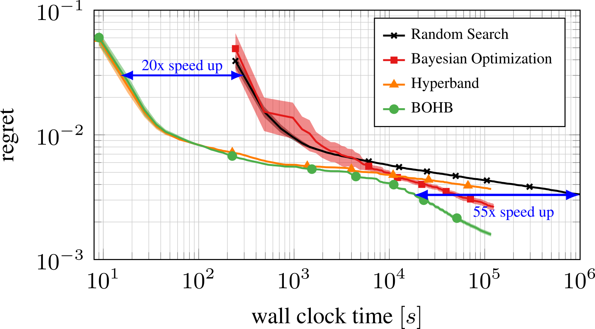
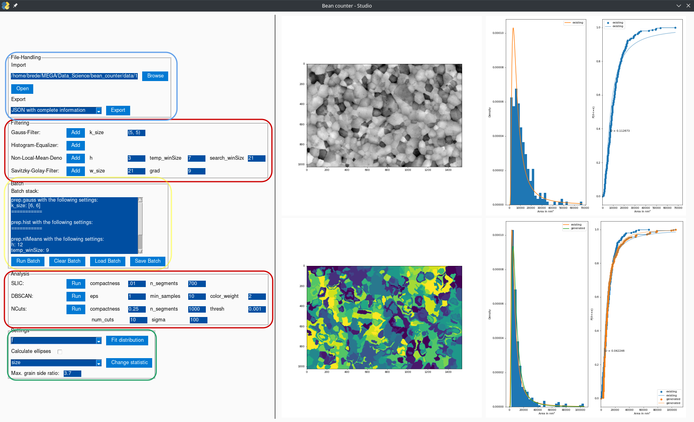

--- 
#title: "Entwicklung eines ML-basierten Tools zur Unterstützung der Bestimmung von Kornverteilungen in elektronenmikroskopischen Aufnahmen."
# subtitle: "Thesis Beschreibung dies das."
#author: "Max Brede"
#date: "`r Sys.Date()`"
site: bookdown::bookdown_site
documentclass: book
classoption: openany
biblio-style: apa
link-citations: yes
bibliography: ../Koerner.bib
lof: yes
lot: no
fontsize: 12pt
linestretch: 1.5
toc-depth: 1
geometry: "left=4cm, right=3cm, top=2.5cm, bottom=2.5cm"
secnumdepth: 1
csl: apa.csl    
lof-title: 'Abbildungsverzeichnis'
lot-title: 'Tabellenverzeichnis'
toc-title: "Inhalt"
---

```{r setup, include=FALSE}
knitr::opts_chunk$set(echo = FALSE, tidy = T, warning = F, message = F)
def.chunk.hook <- knitr::knit_hooks$get("chunk")
knitr::knit_hooks$set(chunk = function(x, options) {
  x <- def.chunk.hook(x, options)
  ifelse(options$size != "normalsize", 
         paste0("\n \\", options$size,"\n\n", x, "\n\n \\normalsize \n"), x)
})
library(broom)
library(tidyverse)
library(kableExtra)
```


<!--chapter:end:index.Rmd-->

# Einleitung

## Motivation und Problemstellung

In der materialwissenschaftlichen Betrachtung von Werkstücken und deren Eignung für gegebene Anwendungsgebiete ist eine möglichst detaillierte Beschreibung und Charakterisierung derer Eigenschaften eine zentrale Voraussetzung. Je genauer ein Werkstück in seinen Eigenschaften beschrieben werden kann, desto besser kann das Verhalten untersucht und vorhergesagt werden [@askelandMaterialwissenschaftenGrundlagenUbungen1996].

Diese Eigenschaften können in verschiedenen Größenordnungen bestimmt und zur Beantwortung unterschiedlicher Fragen genutzt werden. 
Die erste mögliche Auflösung ist die Beschreibung der atomaren Zusammensetzung des Werkstücks sowie des Verhältnisses der verschiedenen Atome zueinander, sollte mehr als ein Element enthalten sein. Aussagen auf dieser Ebene können zum Beispiel Auskunft über elektrische und magnetische Eigenschaften des Werkstücks ermöglichen [@askelandMaterialwissenschaftenGrundlagenUbungen1996].
Als nächste Auflösungsstufe kann die Anordnung dieser Atome zueinander betrachtet werden. Diese so genannte Kristallstruktur kann Aussagen über zum Beispiel die Festigkeit eines Metalls liefern.
In einem Werkstück können Kristalle sowohl mit unterschiedlicher Struktur und Zusammensetzung als auch in unterschiedlicher Ausrichtung zueinander vorkommen. Diese werden als Körner, der ganze Verbund als Korn- oder Mikrostruktur bezeichnet.
Die Orientierung der Kristalle zueinander und in Bezug zur Ausrichtung des Werkstückes zusammen mit der Größe und Form der Kristallite haben darüber hinaus einen großen Einfluss auf das mechanische Verhalten des Materials.

Die Charakterisierung dieser Mikrostruktur ist ein Teil der Aufgaben des Ausbildungsberufs des Metallographen. Diese Fachkräfte werden zum Beispiel in Stahlwerken eingesetzt, wo sie das Gefüge der im Material vorhandenen Kristalle durch Politur und Ätzung sichtbar machen. Diese Verfahren werden eingesetzt, um die Grenzen zwischen Körnern, die natürlicherweise Gitterfehler und damit Schwachpunkte des Materials darstellen, sichtbar zu machen. Da der Gitterverbund an diesen Grenzen schwächer ist, werden Atome hier leichter von Säuren ausgelöst, was zu einem mit einem Lichtmikroskop darstellbaren Höhenunterschied zwischen Korn und Korngrenze führt [@GefugeWerkstoffkunde2021]. Ein Beispiel für ein so behandeltes Werkstück ist in Abbildung \@ref(fig:baseGrain) zu sehen. 

(ref:subCaption1) Lichtmikroskopische Aufnahme von Austenitischem Stahl.

(ref:caption1) Lichtmikroskopische Aufnahme von poliertem und geätztem Austenitischem Stahl, Bild von @MetallographieRostfreiemStahl.

```{r baseGrain, echo = F, fig.cap='(ref:caption1)', fig.align='center', out.width='.8\\textwidth', fig.scap='(ref:subCaption1)'}
knitr::include_graphics('../imgs/fig5.jpg')
```


Um diese Aufnahmen der Schnittbilder zu nutzen, um zu einer quantitativen Beschreibung des Materials zu kommen, wurde traditionell und auch mitunter bis heute eins der vielen "Linienschnittverfahren" eingesetzt, wie es zum Beispiel bei @heynShortReportsMetallurgical1903 beschrieben und als Richtlinienverfahren von der Standardisierungsorganisation ASTM international empfohlen wird [@StandardTestMethods2021].
Neben diesem gibt es noch andere Ansätze zum Durchführen der Linienschnitte, alle diese Verfahren haben aber das folgende Vorgehen gemeinsam:
Zuerst wird auf eine je nach Verfahren festgelegten Vorgehensweise eine Reihe von Linien in die Aufnahme vom Lichtmikroskop gezeichnet. Diese Linien werden dann genutzt, um die Körner auszuzählen und/oder zu vermessen, die von der Linie geschnitten werden. 
Die daraus resultierende Stichprobe an im Werkstück vorhandenen Korngrößen wird abschließend mithilfe einer passenden mathematischen Funktion (z.B. einer log-normalen Verteilungsfunktion) beschrieben, deren Parameter dann als Beschreibung der Kornstruktur genutzt werden.

Neben der verständlichen Ermüdung, die der Bearbeiter bei dieser Methode erfährt, ist die Genauigkeit der Methode grundsätzlich nur approximativ. Daher ist nicht verwunderlich, dass es in diesem Bereich schon Ansätze zur Automatisierung der Materialbeschreibung gibt.
Hier wurde bereits über verschiedene Computervision-Methoden [z.B.: @ananyevCuGdCodoped2014; @heilbronnerAutomaticGrainBoundary2000] und Machine-Learning-Ansätze [z.B.: @decostHighThroughputQuantitative2019; @dengizGrainBoundaryDetection2005] versucht, die Korngrenzen zu extrahieren oder auch die Materialien zu klassifizieren [@abouelattaClassificationCopperAlloys2013].

Diese Verfahren funktionieren gut zur Segmentation von mit Lichtmikroskopie gewonnenen Kornbildern, die durch Ätzung gut darstellbare Korngrenzen aufweisen.
Da mit dem Fortschritt in der Materialtechnik Körner auf immer kleineren Skalen vorliegen, gewinnt die Anwendung höher auflösender mikroskopischer Verfahren aber zunehmend an Wichtigkeit. Insbesondere bei der Betrachtungen von Materialien in dünnen Schichten, das heißt in einer Dicke im Mikro- oder Nanometerbereich, wird eine deutlich höhere Vergrößerung relevant. Der hier nötige Übergang zur Elektronenmikroskopie stellt die automatische Auswertung der Schnittbilder vor neue Probleme. Zwar können bei ätzbaren Oberflächen die oben genannten automatischen Auswertungsmethoden weiter eingesetzt werden, bei besonders kleinen Körnern führt die Ätzung aber zu einem dermaßen großen Angriff der Kornstruktur, dass eine Identifikation und Detektion der Grenzen geradezu unmöglich wird.
Stattdessen werden die Körner über ihre je nach kristallographischer Orientierung unterschiedlich starke Beugung der Elektronen im Rückstreubild in unterschiedlichen Graustufen dargestellt. Diese Graustufenbilder machen das automatisierte Identifizieren der Korngrenzen ungemein schwieriger. Beispiele für solche Aufnahmen sind in Abbildung \@ref(fig:electroGrain) zu sehen.

(ref:subCaption) Elektronenmikroskopische Aufnahmen von Werkstücken.

(ref:caption) Elektronenmikroskopische Aufnahmen von Werkstücken. In rot sind die Linien eingezeichnet, die zur Bestimmung der Kornverteilung mit Hilfe eines Linienschnittverfahrens eingesetzt wurden. Das Werkstück links weist wenig Artefakte und klar zu erkennende Kornflächen auf. Rechts ist ein Werkstück abgebildet, dessen Körner weniger deutlich zu erkennen sind, das Gradienten von Grautönen in einem Korn aufweist und dessen Aufnahme deutliche Bildartefakte produziert hat.

```{r electroGrain, echo = F, fig.cap='(ref:caption)',fig.align='center',out.width='.45\\textwidth', fig.show='hold', fig.scap='(ref:subCaption)'}
knitr::include_graphics(c('../imgs/out1.png',
                          '../imgs/out2.png'))
```

Zusätzlich stören Kristalldefekte, Oberflächenartefakte und Spannungen im Material die Auswertung, da sie zu überlagernden Kontrastartefakten führen (Abbildung \@ref(fig:electroGrain) rechts).
Mit Training sind menschliche Bearbeiter zwar weiter in der Lage, Körner und ihre Grenzen zu detektieren und mit Linienschnittverfahren auszuwerten, bestehende Ansätze zur automatischen Detektion von Korngrenzen scheitern aber.

Im Bereich der Mineral-Korn-Erkennung wurden aber bereits erfolgreich vielversprechende Ansätze berichtet [@latifDeepLearningBasedAutomaticMineral2022; @maitreMineralGrainsRecognition2019]. Diese neuen Ansätze haben gemeinsam, dass sie statt Korngrenzen Flächen der Körner auszumachen versuchen. Dabei werden Methoden der *Superpixel Segmentation* eingesetzt, bei denen versucht wird, ein Bild in semantisch ähnliche Gruppen von Pixeln zu segmentieren. Das Aufteilen eines Bildes in diese Gruppen von ähnlichen Pixeln oder auch *Superpixel* ist ein Reduzieren der Bildkomplexität für folgende Analyseschritte [@wangSuperpixelSegmentationBenchmark2017]. Eine Anwendung von Superpixel-basierten Ansätzen zur Segmentation von mikroskopischen Aufnahmen von Metallstrukturen sind entweder zu hochauflösend [@akersRapidFlexibleSegmentation2021], zu niedrig auflösend [@kimUnsupervisedMicrostructureSegmentation2020] oder auf andere Arten von Mineralien [@decostHighThroughputQuantitative2019; @latifDeepLearningBasedAutomaticMineral2022] oder nur auf Teile der Aufnahme bezogen [@liMetallographicImageSegmentation2020].

Da die Vorbereitung und das spezifische ausgewertete Material stark die Art und Qualität der Bilder beeinflusst, lassen sich diese Ergebnisse nicht direkt auf Aufnahmen von dünnen Schichten übertragen - die Ansätze scheinen aber vielversprechend. Die Auswertung der Größenverteilung möglichst aller Körner über die gesamte elektronenmikroskopische Aufnahme dünner Schichten ist jedoch bisher noch nicht gelöst.

Die vorliegende Masterarbeit soll an diesem Punkt ansetzen und versuchen, auf Basis von Superpixel-Verfahren möglichst alle Körner in einer elektronenmikroskopischen Aufnahme zu erkennen und diese zu vermessen.


## Unternehmensvorstellung

Die Arbeit wird in enger Abstimmung mit dem Institut für Materialphysik der Georg-August-Universität Göttingen umgesetzt und basiert auf dort aufgenommenen Kornbildern.
Die Georg-August-Universität Göttingen wurde 1734 gegründet und zählt mit ihren 29.167 Studierenden im WiSe 21/22 [@offentlichkeitsarbeitStudiumUndLehre] und den 5.165 Beschäftigten im Jahr 2021 [@offentlichkeitsarbeitPersonalGeorgAugustUniversitatGottingen] zu den größten Hochschulen Deutschlands. Am Lehrstuhl für Materialphysik wird regelmäßig das Verhalten von Materialien in dünnen Schichten untersucht, deren Oberflächen dazu elektronenmikroskopisch aufgenommen und händisch per Linienschnitt ausgewertet werden.


## Zielsetzung

Das Ziel dieser Abschlussarbeit ist die Entwicklung eines Tools, das die Auswertung von Kornbildern so weit es geht unterstützt.
Als erster Schritt ist dafür eine Implementierung mit grafischer Oberfläche nötig, die das Einlesen und Verarbeiten von elektronenmikroskopischen Aufnahmen mit dahinter stehendem Datenmodell unterstützt. 
Dabei soll die Verarbeitung sowohl aus dem Vorverarbeiten als auch der Kornerkennung und -vermessung bestehen.
Die Nutzbarkeit des Tools soll durch Angehörige des Instituts getestet und dessen Nutzen überprüft werden. Die bei dieser Überprüfung entstehenden Wünsche an Verbesserungen und Anpassungen des Programms sollen so weit wie möglich umgesetzt werden.
Dabei ist insbesondere auch wichtig, das Tool möglichst nachnutzbar zu gestalten und eventuell nötige Erweiterungen so sehr zu vereinfachen wie möglich.

<!-- Im zweiten Schritt soll auf dem Datenmodell aufbauend versucht werden, mit Hilfe von Superpixel- und ML-Modellen die Auswertung durch Einstellungs-Empfehlungen zu unterstützen oder im besten Falle zu übernehmen. -->
<!-- Um das Ergebnis möglichst zukunftsorientiert zu gestalten, wird zum Einen versucht, das Tool möglichst Erweiterungs-offen zu gestalten. Zum Anderen wird Python als Sprache gewählt, die in dem betreffenden Wissenschaftsbereich bereits weit verbreitet genutzt wird. -->


## Aufbau der Arbeit

Im Folgenden wird zuerst auf die Grundlagen der verwendeten Filter- und Auswertungsmethoden und deren Funktionsprinzipien eingegangen. 
Im darauf folgenden Kapitel wird das Anforderungsprofil der Anwendung formuliert, gefolgt von einer Beschreibung der Entwicklung des Tools.
Nutzbarkeit und Nutzen des Tools werden im vorletzten Kapitel evaluiert, wonach eine Schlussbetrachtung sowie ein Ausblick auf im Anschluss weiter zu untersuchende Ansätze folgt.


<!--chapter:end:intro.Rmd-->

# Grundlagen

Dieses Kapitel beschäftigt sich zuerst mit den zur Bildvorbereitung betrachteten und verwendeten Algorithmen. Darauf folgt eine Beschreibung der getesteten Ansätze zur Flächen-Gruppierung, um dann dazu überzugehen, die Implementation des Körner-Tools zu beschreiben.
Im Anschluss werden die notwendigen Ansätze zur Extraktion der Kornstrukturen und ihrer Automatisierung erklärt.


## Bildvorverarbeitung

Im Folgenden werden die einzusetzenden Vorverarbeitungsalgorithmen beschrieben. Da das Augenmerk dieser Arbeit insbesondere auf der Erkennung von Körnern und weniger auf dem Vorverarbeiten liegen soll, stehen an dieser Stelle die bereits in der Kornvermessung eingesetzte Algorithmen im Vordergrund der Betrachtung.
Alle diese Vorverarbeitungs-Schritte verfolgen zwei Ziele: 
Zum einen soll versucht werden, die Bildartefakte so gut wie möglich zu entfernen, zum anderen sollen die Grautöne innerhalb eines Korns so gut angeglichen werden wie möglich.
Die Reihenfolge, in der die Algorithmen angewandt werden, ist außerdem von entscheidender Bedeutung, ein Histogramm-Equalizer führt nach Anwendung eines Gauss-Filters zu einem deutlich anderen Effekt als davor. Auf diesen Punkt wird aber in der Beschreibung der Implementation noch umfangreicher eingegangen.

```{r, include = F, eval=F}
minmax <- function(x)(x-min(x))/(max(x)-min(x))
n <- 200
p <- tibble(
  x = rep(1:n, times = n),
  y = rep(1:n, each = n),
  color =  case_when(
    y < .25 * n  &  x < .5 * n~  as.integer(round(minmax(sin(sqrt(x^2 + y^2)/3) 
                                                         + .5 * rnorm(n^2))*n)),
    y < .25 * n  &  x >= .5 * n~  as.integer(round(minmax(sin(sqrt(x^2 + y^2)/3) 
                                                         + .5 * rf(n^2,2,23))*n)),
    y < .5 * n ~ as.integer((1 - x %/% (n / 4 + 1) %% 2) * n),
    y < .75 * n ~ as.integer(abs(x - n  - 1)),
    T ~ as.integer(round(minmax(cos(x) * x) * n))
)) %>%
  ggplot(aes(x, y, fill = color, color = color)) +
  geom_tile() +
  coord_equal() +
  theme_void() +
  theme(legend.position = 'none') +
  scale_fill_gradient(low = 'white',
                      high = 'black')+
  scale_color_gradient(low = 'white',
                      high = 'black')

ggsave(plot = p, filename = '../imgs/geometric.png', width = 5, height = 5,bg = 'white')

```

### Gauss-Filter

Gauss-Filter werden häufig in Anwendungsbereichen mit multivariaten Untersuchungsgegenständen eingesetzt, so zum Beispiel in EEG- und fMRT-Analysen [@harishvijeyAutomatedTechniqueEEG2022; @winkDenoisingFunctionalMR2004], in Zeitreihenanalysen [@kitagawaTwofilterFormulaSmoothing1994] und nicht zuletzt weit verbreitet in der Bildverarbeitung [@basuGaussianbasedEdgedetectionMethodsa2002]. 

Bei diesem Verfahren wird das Bild auf Basis einer zweidimensionalen Gauss-Dichte-Funktion gefaltet, wodurch jedes Pixel durch die gewichtete Summe der umliegenden Pixel ersetzt wird. Die dabei als Gewichtung eingesetzte, zweidimensionale Dichte-Funktion wird auch als der *Kernel* bezeichnet. In Abb. \@ref(fig:gaussFilter) ist beispielhaft das Ergebnis eines Gauss-Filters zu sehen. In der Abbildung wird dessen primäre Funktion deutlich. Die harten Kanten des Bildes werden zunehmend weicher mit größerer Kernel-Einstellung, außerdem werden die einzelnen, herausstechenden Pixel im unteren Viertel der Abbildung ihrem Umfeld angeglichen und stechen weniger deutlich hervor.
Dieser auch als Glättungs-Filter bezeichnete Vorverarbeitungs-Algorithmus wird mit dem Ziel eingesetzt, Pixel mit extremen Werten an ihr direktes Umfeld anzugleichen und damit Bildartefakte zu entfernen.

(ref:gaussFilterCap) Beispiel eines Gauss-Filters.

(ref:gaussFilterSubCap) Beispiel eines Gauss-Filters. Links ist das Bild vor dem Filtern, in der Mitte nach dem Filtern mit einem Gausskernel mit Durchmesser von 15 Pixeln (1% der Bildkantenlänge) und rechts einem mit Durchmesser von 151 Pixeln (~10% der Kantenlänge) zu sehen.

```{r gaussFilter, echo = F, fig.cap='(ref:gaussFilterSubCap)', fig.align='center',out.width='.32\\textwidth', fig.show='hold', fig.scap='(ref:gaussFilterCap)'}
knitr::include_graphics(c('../imgs/geometric.png','../imgs/gauss15.png','../imgs/gauss150.png'))
```


### Histogramm-Equalizer

Ein Histogramm-Equalizer gleicht die Helligkeitswerte eines Bildes so an, dass die kumulative Häufigkeitsverteilung der Helligkeitswerte linear ansteigt [@princePartIVPreprocessing2012]. Je nach Bild kann es also passieren, dass Teile der Helligkeitswert-Verteilung gestreckt, andere Teile gestaucht werden. 
Diese nicht-lineare Transformation führt dazu, dass bei nicht-linearen Helligkeitsverteilungen, wie zum Beispiel im Falle eines Bildes mit vielen ähnlichen Grautönen, vorher kleine Unterschiede deutlicher akzentuiert werden, während stark unterschiedliche Helligkeitswerte angenähert werden können.
In Abb. \@ref(fig:histEqual) ist der Effekt des Histogramm-Equalizers beispielhaft dargestellt. Der Farbverlauf im unteren Viertel der oberen Hälfte der Abbildung wurde verdunkelt, genau wie die erste, auf dem Cosinus basierenden Zeile mit Ausnahme einer weißen Spalte. Unter den geometrischen Muster sind die Helligkeitsverteilungen vor und nach der Anwendung des Filters zu sehen, die Linearisierung der Helligkeitsverteilung ist deutlich zu erkennen.

```{r, eval = F, include=F}
p <- c('../imgs/geometric.png') %>% 
  map_dfr(~as.data.frame(imager::load.image(.)),.id = 'image') %>% 
  transmute(value = sort(value),
            p = 1/length(value),
            cs = cumsum(p)) %>% 
  group_by(value) %>% 
  summarise(cs = max(cs, na.rm=T)) %>% 
  ggplot(aes(x = value, y = cs)) +
  geom_point() +
  theme_minimal() +
  xlim(-0.1,1.1) +
  ylim(-0.1,1.1) +
  labs(y = 'Kummulative Häufigkeit',
       x = 'Intensität')


ggsave(plot = p, '../imgs/hist_kum1.png',width = 5, height = 5) # zwei Grafiken wären wohl besser...

p <- c('../imgs/hist_equal.png') %>% 
  map_dfr(~as.data.frame(imager::load.image(.)),.id = 'image') %>% 
  transmute(value = sort(value),
            p = 1/length(value),
            cs = cumsum(p)) %>% 
  group_by(value) %>% 
  summarise(cs = max(cs, na.rm=T)) %>% 
  ggplot(aes(x = value, y = cs)) +
  geom_point() +
  theme_minimal() +
  xlim(-0.1,1.1) +
  ylim(-0.1,1.1) +
  labs(y = 'Kummulative Häufigkeit',
       x = 'Intensität')

ggsave(plot = p, '../imgs/hist_kum2.png',width = 5, height = 5)
```

(ref:histEqualizerCap) Beispiel für die Anwendung eines Histogramm-Equalizers.

(ref:histEqualizerSubCap) Beispiel für die Anwendung eines Histogramm-Equalizers. Links ist das Bild vor, rechts nach der Anpassung der Helligkeitsverteilung zu sehen. Der Farbverlauf wurde verdunkelt, genau wie die erste, auf dem Cosinus basierenden Zeile mit Ausnahme einer weißen Spalte. Unten sind die Helligkeitsverteilungen abgebildet, die Linearisierung ist deutlich zu erkennen.

```{r histEqual, echo = F, fig.cap='(ref:histEqualizerSubCap)', fig.align='center',out.width='.48\\textwidth', fig.show='hold', fig.scap='(ref:histEqualizerCap)'}
knitr::include_graphics(c('../imgs/geometric.png', '../imgs/hist_equal.png'), dpi = 300)
knitr::include_graphics(c('../imgs/hist_kum1.png','../imgs/hist_kum2.png'),dpi = 300)
```

### Non-Local-Mean-Denoiser

Ein Non-Local-Mean Denoiser versucht, Bildrauschen durch das Ersetzen der Grauwerte ähnlich grauer, nicht unbedingt nebeneinander liegender Pixel durch deren Grauwert-Mittelwert zu reduzieren. Dazu wird in einem angegebenen Suchfenster für alle ähnlich grauen Pixel der Mittelwert der Grauwerte als neuer Grauwert gesetzt. Die Pixel müssen dabei explizit nicht lokal nebeneinander liegen, sondern nur einen ähnlichen Grauwert aufweisen [@buadesNonLocalMeansDenoising2011]. 

Der Filter wird dabei über eine Filter-Stärke, die Größe des Suchfensters und die Größe des "Templates", also der Menge an Gruppen als gleich gezählter Pixel, bestimmt.

In Abb. \@ref(fig:nlMeans) ist der Effekt des Denoisers zu sehen, das Bildrauschen im unteren Viertel wird deutlich reduziert, auch wenn das Muster dadurch leicht undeutlich wird. Der Denoiser stößt jedoch an seine Grenzen bei der Entfernung nicht-normalen Rauschens, wie zum Beispiel in der rechten Hälfte der letzten Zeile zu sehen ist. Dort wurde im Gegensatz zur linken Hälfte kein normalverteiltes, sondern F-verteiltes Rauschen auf das Bild addiert. Durch die schiefe Form der F-Verteilung sind so deutlich dunklere Pixel entstanden, die als Ausreißer nicht vom Non-Local-Mean Denoiser entfernt werden, da sie nicht ähnlich genug zu den restlichen Pixeln sind.

(ref:nlMeansSubCap) Beispiel für die Anwedung eines Non-Local_Mean Denoisers.

(ref:nlMeansCap) Beispiel für die Anwedung eines Non-Local_Mean Denoisers. Links ist das Bild, rechts nach dem Denoising mit einer Template-Größe von 7, einem Suchfenster von 21 zu sehen, der Filter wurde verhältnismäßig stark gewichtet um den Einfluss deutlich zu machen. Das Rauschen wurde zwar reduziert, die konzentrischen Kreise aber auch unschärfer.

```{r nlMeans, echo = F, fig.cap='(ref:nlMeansCap)', fig.align='center',out.width=paste0(.96/2,'\\textwidth'), fig.show='hold', fig.scap='(ref:nlMeansSubCap)'}
knitr::include_graphics(c('../imgs/geometric.png', '../imgs/nlMean_30_7_21.png'), dpi = 300)
```


### Savitzky-Golay-Filter
```{r, eval = F, include=F}
p <- c('../imgs/savgol51_1.png') %>% 
  map_dfr(~as.data.frame(imager::load.image(.)),.id = 'image') %>% 
  transmute(value = sort(value),
            p = 1/length(value),
            cs = cumsum(p)) %>% 
  group_by(value) %>% 
  summarise(cs = max(cs, na.rm=T)) %>% 
  ggplot(aes(x = value, y = cs)) +
  geom_point() +
  theme_minimal() +
  xlim(-0.1,1.1) +
  ylim(-0.1,1.1) +
  labs(y = 'Kummulative Häufigkeit',
       x = 'Intensität')

ggsave(plot = p, '../imgs/savgol1.png',width = 5, height = 5)

p <- c('../imgs/savgol51_5.png') %>% 
  map_dfr(~as.data.frame(imager::load.image(.)),.id = 'image') %>% 
  transmute(value = sort(value),
            p = 1/length(value),
            cs = cumsum(p)) %>% 
  group_by(value) %>% 
  summarise(cs = max(cs, na.rm=T)) %>% 
  ggplot(aes(x = value, y = cs)) +
  geom_point() +
  theme_minimal() +
  xlim(-0.1,1.1) +
  ylim(-0.1,1.1) +
  labs(y = 'Kummulative Häufigkeit',
       x = 'Intensität')

ggsave(plot = p, '../imgs/savgol5.png',width = 5, height = 5)

p <- c('../imgs/savgol51_11.png') %>% 
  map_dfr(~as.data.frame(imager::load.image(.)),.id = 'image') %>% 
  transmute(value = sort(value),
            p = 1/length(value),
            cs = cumsum(p)) %>% 
  group_by(value) %>% 
  summarise(cs = max(cs, na.rm=T)) %>% 
  ggplot(aes(x = value, y = cs)) +
  geom_point() +
  theme_minimal() +
  xlim(-0.1,1.1) +
  ylim(-0.1,1.1) +
  labs(y = 'Kummulative Häufigkeit',
       x = 'Intensität')

ggsave(plot = p, '../imgs/savgol11.png',width = 5, height = 5)
```

Ein Savitzky-Golay-Filter wird in allen Bereichen der Signalverarbeitung zur Signalglättung eingesetzt. Hierzu wird eine Fenstergröße und ein Grad für das zu nutzende Polynom festgelegt. Das Verfahren fitted iterativ in je einem Abschnitt in der angegebenen Fenstergröße über die gesamte Zeitreihe eine polynomiale Regression des angegebenen Grades. Das Mittel der Vorhersagen dieser Regressionen über die Datenreihe wird dann zurückgegeben. Je nach Größe des Fensters und der Höhe des Polynoms wird dadurch unterschiedlich stark geglättet.

In Abb. \@ref(fig:savgol) ist der Effekt je eines horizontalen und vertikalen Savitzky-Golay-Filters mit jeweils einer Fenstergröße von 51 Pixeln und einem Polygon der 1., 5. und 11. Ordnung beispielhaft dargestellt. Wie zu sehen ist, schlägt sich der Filter bei Polynomen niedrigeren Grades eher als Unschärfe nieder, je höher die Grade sind, desto mehr Varianz im Signal wird nicht entfernt. Je höher der Grad des Polynoms für den Filter also gewählt wird, desto weniger stark wird das Bild durch den Filter verändert - desto weniger Rauschen wird aber auch entfernt.

(ref:savgolCap) Beispielhafte Darstellung eines Savitzky-Golay-Filters.

(ref:savgolSubCap) Beispielhafte Darstellung eines Savitzky-Golay-Filters. Links ist das Bild vor, rechts nach der Glättung der Helligkeitsverteilung mit einem Polynom 1., 5. und 11. Grades zu sehen. Unten sind die Helligkeitsverteilungen abgebildet.

```{r savgol, echo = F, fig.cap='(ref:savgolSubCap)', fig.align='center',out.width='.24\\textwidth', fig.show='hold', fig.scap='(ref:savgolCap)'}
knitr::include_graphics(c('../imgs/geometric.png', 
                          '../imgs/savgol51_1.png', 
                          '../imgs/savgol51_5.png', 
                          '../imgs/savgol51_11.png'), dpi = 300)
knitr::include_graphics(c('../imgs/hist_kum1.png','../imgs/savgol1.png',
                          '../imgs/savgol5.png','../imgs/savgol11.png'),dpi = 300)
```


## Extraktion der Kornstrukturen 

Der folgende Abschnitt beschäftigt sich mit den möglichen Ansätzen zur Erkennung und Extraktion der Kornflächen. 
<!-- Für einen Überblick über Methoden zur Erkennung von Superpixeln und mögliche Architekturen zur Vermessung von Kornbildern. -->


### DBSCAN

Der ursprünglich zur Gruppierung großer Datenbanken entwickelte *Density-based Spatial Clustering of Applications with Noise* (DBSCAN) Algorithmus [@esterIncrementalClusteringMining1998] konnte bereits erfolgreich zur Superpixel-Segmentierung in Echtzeit eingesetzt werden [@shenRealTimeSuperpixelSegmentation2016]. 

Der DBSCAN-Cluster-Algorithmus überprüft für jeden einzelnen Datenpunkt, wie viele Datenpunkte in einem vorgegebenen Radius $\epsilon$ um den betrachteten Punkt liegen. Das Verfahren sortiert so Datenpunkt für Datenpunkt lokal über den Radius verknüpfte Einträge zusammen, die als zu einem Cluster zugehörig erklärt werden, sobald eine angegebene Mindestanzahl an Samples erreicht ist.

Durch das iterative Vorgehen bei diesem Verfahren ist die Form der erkannten Cluster nicht festgelegt. Dadurch können auch komplexe Formen im Feature-Raum abgebildet werden. Ein weiterer Vorteil ist die geringe Anfälligkeit für Ausreißer, da sich nicht im Radius um andere Punkte befindliche Datenpunkte einfach keinem Cluster zu sortiert werden.

In Abb. \@ref(fig:dbscanExample) ist der Einfluss verschieden großer Radien und Mindest-Clustergrößen dargestellt. Die Werte wurden vor dem Clustern so skaliert, dass x- und y-Achse sowie die Farbwerte des ursprünglichen Bilds zwischen 0 und 100 liegen.

(ref:dbscanExampleSubCap) Beispiel für Ergebnisse des DBSCAN-Algorithmus.

(ref:dbscanExampleCap) Beispiel für Ergebnisse des DBSCAN-Algorithmus. Die Graphen stellen dasselbe Muster dar, wie zur Illustration der Vorverarbeitungsmethoden genutzt wurde. In der ersten Zeile wurde $\epsilon$ auf 1, in der zweiten Zeile auf 2 gesetzt. Oben wurde die Mindestzahl an Pixeln auf 5, unten  auf 10 gesetzt. Die Werte sind so skaliert, x- und y-Achse sowie die Grauwerte des ursprünglichen Bilds zwischen 0 und 100 liegen. Darunter ist das ursprüngliche Bild dargestellt.


```{r dbscanExample, echo = F, fig.cap='(ref:dbscanExampleCap)', fig.align='center',out.width=paste0(.8/2,'\\textwidth'), fig.show='hold', fig.scap='(ref:dbscanExampleSubCap)'}
knitr::include_graphics(c('../imgs/dbscan_1_5.png', '../imgs/dbscan_1_10.png'), dpi = 300)
knitr::include_graphics(c('../imgs/dbscan_2_5.png', '../imgs/dbscan_2_10.png'), dpi = 300)
knitr::include_graphics(c('../imgs/geometric.png'), dpi = 300)
```

```{r, include=F, eval=F}
library(tidyverse)
img <- as.data.frame(imager::load.image('../imgs/geometric.png')) %>% 
  filter(value != 1,
         x %% 5 == 0,
         y %% 5 == 0) %>% 
  select(-cc) %>% 
  mutate(y = max(y) - y,
         across(where(is.numeric), ~100 * (.-min(.))/(max(.)-min(.))))

settings <- expand.grid(seq(1.5,3,.5), seq(5,15,5))
clustered <- lapply(1:9, 
                    \(.x){
                      start = Sys.time()  
                      res = dbscan::dbscan(img, settings[.x,1], settings[.x,2])
                      res$stop = Sys.time() - start
                      return(res)})
res <- map_dfr(clustered, ~mutate(img, cluster = .$cluster, eps = .$eps, minPts = .$minPts, time = .$stop))

p <- res %>% 
  mutate(cluster = ifelse(cluster %in% -1:0, NA, cluster),
         cluster = as.factor(cluster%%8)) %>% 
  ggplot(aes(x,y,color = cluster, fill = cluster)) +
  geom_tile() +
  geom_text(x = 50, y = 102,color = 'black', aes(label=round(time,2))) +
  facet_grid(eps ~ minPts) +
  coord_fixed() +
  theme_minimal()+
  theme(legend.position = 'none') +
  scale_fill_brewer(palette='Dark2')+
  scale_color_brewer(palette='Dark2')

ggsave(filename = '../imgs/dbscan.png',
       width = 12, height = 12, dpi = 150,bg = 'white')
```


### SLIC

Beim als Superpixel-Segmentierungsansatz weit verbreiteten *Simple Linear Iterative Clustering* (SLIC) [@achantaSLICSuperpixelsCompared2012] wird ein k-Means basiertes Verfahren genutzt, um näherungsweise gleich große Superpixel im Bild zu detektieren.
Dabei wird sowohl für den Farb- als auch den Pixelraum je eine euklidische Distanz aller Pixel zueinander berechnet, die dann gewichtet aufsummiert wird. Dabei wird in der Arbeit von @achantaSLICSuperpixelsCompared2012 die räumliche Distanz gewichtet, wodurch mit hohen Werten des Parameters *m* die räumliche Nähe, mit niedrigen Werten die farbliche Nähe stärker gewichtet wird.

Der weitere Algorithmus ist im Prinzip der des normalen k-Means Clustering, das heißt Cluster-Kerne werden definiert (bei SLIC in regelmäßigen Abständen), Pixel werden den nächsten Clustern zugeordnet und die Zentroide dann auf die Zentroide der neuen Cluster verschoben.
Im Gegensatz zum regulären k-Means wird bei SLIC aber nicht im gesamten Datenraum nach möglichen Cluster-Angehörigen gesucht, sondern nur im doppelten Suchraum der vorgegebenen Clustergröße.
@achantaSLICSuperpixelsCompared2012 beschreiben außerdem eine adaptive Version des SLIC, bei dem die Cluster-Größe (und Anzahl) und die Gewichtung von räumlicher und farblicher Distanz clusterweise angepasst wird. Dazu wird in jeder Iteration an der maximalen Distanz der vorhergehenden Iteration normalisiert.
In Abb. \@ref(fig:slicExample) ist ein Beispiel für den ASLIC-Algorithmus mit unterschiedlichen *m*-Gewichten und anfänglicher Cluster-Anzahl zu sehen.

(ref:slicExampleSubCap) Beispiel für eine Superpixel-Segmentierung mit SLIC.

(ref:slicExampleCap) Beispiel für eine Superpixel-Segmentierung mit SLIC. Dargestellt sind die Cluster-Label als Grauschattierung. Links ist die Segmentierung mit 250 Start-Cluster-Zentren, rechts mit 500 dargestellt, oben je mit .05, unten mit 2 als Wert für *m* zu sehen. In beiden Beispielen wurde die Adaptive Version des SLIC-Algorithmus wie bei @achantaSLICSuperpixelsCompared2012 beschrieben eingesetzt. Unter den verarbeiteten Bildern ist das ursprüngliche Bild dargestellt.

```{r slicExample, echo = F, fig.cap='(ref:slicExampleCap)', fig.align='center',out.width=paste0(.8/2,'\\textwidth'), fig.show='hold', fig.scap='(ref:slicExampleSubCap)'}
knitr::include_graphics(c('../imgs/slic_5_250.png', 
                          '../imgs/slic_5_500.png'), dpi = 300) 
knitr::include_graphics(c('../imgs/slic_200_250.png', 
                          '../imgs/slic_200_500.png'), dpi = 300)
knitr::include_graphics(c('../imgs/geometric.png'), dpi = 300)
```


### Normalized Cuts

Beim *Normalized Cuts* Verfahren zur Extraktion von Superpixeln [@shiNormalizedCutsImage2000] wird das Bild in einen Graphen übersetzt, bei dem jeder Pixel durch einen Knoten repräsentiert wird. Jeder dieser Knoten wird dann mit jedem anderen Knoten über eine Kante verbunden, die über ein Maß gewichtet wird, das die Wahrscheinlichkeit der "Zugehörigkeit zu einem Objekt" [@shiNormalizedCutsImage2000] ausdrückt.
Im Orginal-Paper wird die Wahrscheinlichkeit durch eine gewichtete Exponential-Funktion mit den Kontrastwerten und den geometrischen Distanzen im Exponenten ausgedrückt. Für beide Werte ist je eine Gewichtung vorgesehen, die angepasst werden kann - außerdem ein maximal zu berücksichtigender Radius für den geometrischen Abstand.

Unabhängig von der genauen Gewichtung der Kanten wird anschließend derjenige Schnitt gesucht, der die geringste Summe an Kantengewichten "durchtrennt". Dieser *Normalized Cut* wird so bestimmt, dass die durch den Schnitt getrennten Gruppen möglichst unterschiedlich und die verbleibenden Gruppen in sich möglichst homogen sind.  Die Lösung dieses Problem für ein ganzes Bild kann sehr aufwendig sein, weswegen zur Optimierung nur im geometrischen Umfeld der betrachteten Knoten gesucht wird.
Statt die Kanten mit der Wahrscheinlichkeits-Formel aus dem Papier von @shiNormalizedCutsImage2000 zu gewichten, können auch beliebige andere Gewichte gesetzt werden. So ist in der Implementation von NCuts, die in der Dokumentation des scikit-image-Python-Moduls[@NormalizedCutSkimage] präsentiert wird, der Graph mit den Ergebnissen einer SLIC-Voranalyse gewichtet. Vor allem bei großen Bildern wird die von @shiNormalizedCutsImage2000 präsentierte Berechnung nahezu unmöglich, ohne große Optimierung ist allein eine Ergebnis-Matrix mit mindestens $\frac{N_{Pixel}^2}{2}$ Einträgen nötig.
Da SLIC aber in gewisser Form auch eine \glqq{}Wahrscheinlichkeit der Zugehörigkeit zum selben Objekt" abdeckt und besonders bei großen Bildern die Findung einer Lösung für den optimalen Schnitt aufwendig wird, ist die Vorverarbeitung in diesem Sinne eine sinnvolle Optimierungs-Option.
Bei der Findung der optimalen Lösung können eine Reihe von Einstellungen gesetzt werden. Neben den Einstellungen für die SLIC-Vorsegmentierung kann die Anzahl der gesuchten Schnitte, die maximale Distanz zwischen zwei Farben, um als ähnlich erkannt zu werden, und zuletzt der minimale Wert, den ein Schnitt haben darf, um durchgeführt zu werden.

In Abb. \@ref(fig:ncutsClassic) sind Beispiele für NCuts-Anwendungen mit unterschiedlichen Einstellungen zu sehen.

(ref:ncutsClassicSubCap) Beispiel für eine Superpixel-Segmentierung mit NCuts

(ref:ncutsClassicCap) Beispiel für eine Superpixel-Segmentierung mit NCuts mit vorgeschalteter SLIC-Segmentierung. Die SLIC-Segmentierung wurde mit .05 als geometrisches Gewicht und 2000 Start-Clustern durchgeführt. In der oberen Zeile wurde der minimale Schnittwert auf .001, in der unteren Zeile auf .5 gesetzt. Die linken Bilder wurden mit 10, die rechten mit 100 Schnitten geteilt. Zusätzlich sind die Bilder links oben und recht oben mit einer maximalen Farbdistanz von 20, die anderen beiden mit je 100 erstellt. Unter den verarbeiteten Bildern ist das ursprüngliche Bild dargestellt.


```{r ncutsClassic, echo = F, fig.cap='(ref:ncutsClassicCap)', fig.align='center',out.width=paste0(.8/2,'\\textwidth'), fig.show='hold', fig.scap='(ref:ncutsClassicSubCap)'}
knitr::include_graphics(c('../imgs/ncuts_5_2000_1.0_10_20.png', 
                          '../imgs/ncuts_5_2000_1.0_100_100.png'), dpi = 300) 
knitr::include_graphics(c('../imgs/ncuts_5_2000_500.0_10_100.png', 
                          '../imgs/ncuts_5_2000_500.0_100_20.png'), dpi = 300)
knitr::include_graphics(c('../imgs/geometric.png'), dpi = 300)
```


### Hyperband und Bayesianische Optimierung

Die Performance von Verfahren des maschinellen Lernens, zu denen auch Cluster-Verfahren wie DBSCAN und k-Means zählen, ist stark abhängig von der Wahl der richtigen Einstellungen des Verfahrens [z.B. @snoekPracticalBayesianOptimization2012]. @rodriguezClusteringAlgorithmsComparative2019a konnten zum Beispiel zeigen, dass die zufällige Auswahl von Einstellungen in einer besseren Performance bei ihrem Test gängiger Clusterverfahren resultierte, als die Verfahren mit ihren Grundeinstellungen anzuwenden. 
Die zufällige Auswahl dieser auch *Hyperparameter* genannten Einstellungen ist ein gängiges, auch *random search* genanntes Verfahren zum Tuning, also der Verbesserung der Performance von Anwendungen im Deep Learning. Hier ist die Auswahl geeigneter Einstellungen für das Modell insbesondere wichtig, aber auch zeitaufwändig, da die möglichen Stellschrauben für ein genügend komplexes Modell so viele mögliche Kombinationen bieten können. @bergstraAlgorithmsHyperParameterOptimization2011 nennen die geeignete Wahl an Parametern deswegen auch *"more of an art than a science."*.
Das Problem wird zusätzlich vergrößert, da Hyperparameter-Optimierungen in den meisten Fällen Black-Box Optimierungen sind. Das heißt, dass keine verlässliche Annahmen über die Form und Art der Zielfunktion (zum Beispiel in Form eines Gütemaßes der Modellvorhersage) getroffen werden kann, außer durch die systematische Eingabe und Aufzeichnung der Ausgabe ausgewählter Hyperparameter. Neben dem Random Search sind in diesem Forschungsbereich auch eine Reihe von wesentlich effizienteren Algorithmen zur Auswahl von Modell-Einstellungen publiziert worden [@eggenspergerHPOBenchCollectionReproducible2021 für eine erste Übersicht].
Ein Beispiel für eine solche Vorgehensweise zum Optimieren der Modelleinstellungen mit dem Ziel, die optimale Vorhersage zu treffen, ist die von @falknerBOHBRobustEfficient2018 vorgeschlagene *Bayesian Optimization and Hyperband* (BOHB)-Methode. Diese Kombination von Hyperband- und Bayesianischen Hyperparameter-Optimierungslösungen stellt eine effizientere Optimierungs-Alternative zur Random Search dar. Dieser Effizienzgewinn resultiert aus der Nutzung von Zwischenergebnissen zur Verbesserung von Optimierungszeit und Effizienz im Gegensatz zur komplett Zwischenergebnis-agnostischen Black Box-Methode Random Search.

BOHB arbeitet dabei mit einer Kombination eines *Tree-structured Parzen Estimators* [@bergstraAlgorithmsHyperParameterOptimization2011] und eines durch dieses Bayesianische Schätzverfahren informierten Hyperband-Verfahrens [@liHyperbandBanditbasedConfiguration2017]. Beim Tree-structured Parzen Estimators (TPE) wird der Parameter-Raum als Entscheidungsbaum formalisiert. Aus diesem Baum werden dann die Äste ausgewählt, für die ein möglichst minimaler Wert der Zielfunktion mit dem nicht-parametrischen Parzen-Fenster-Kerndichteschätzer vorhergesagt wird. Die so ausgewählte Parameter-Kombination wird genutzt, um das Modell zu trainieren und die Performance des Ergebnisses genutzt, um die Dichteschätzung zu aktualisieren.
An dem Punkt des nötigen Modelltrainings zur Aktualisierung der Performance-Prognose setzt der Hyperband-Teil des BOHB-Verfahrens an. Statt für jede zu testende Parameterkombination das ganze Modell zu trainieren, führen @liHyperbandBanditbasedConfiguration2017 ein Budget als weiteren Parameter ein. Dieses Budget ist so definiert, dass geringere Werte zu einem Modell führen, das zeitlich und hinsichtlich des Rechenaufwands weniger aufwendig ist, dabei aber eine Idee für die Performance eines Modells auf Basis dieser Werte gibt. Bei Modellen aus dem Deep Learning kann das Budget zum Beispiel als die Anzahl der Trainingsepochen operationalisiert werden, bei Cluster-Algorithmen zum Beispiel als eine Beschränkung der jeweils zur Distanzberechnung genutzten Datenpunkte. Beim Hyperband-Verfahren wird also auf niedrigem Budget zuerst eine Reihe an schnellen, "nicht vollständigen" Tests durchgeführt, deren Settings im Original zufällig ausgewählt wurden. Die Settings der besten *n* dieser Tests wird im Folgenden genutzt, um eine Reihe höher budgetierter Tests durchzuführen. Diese fortschreitende Verkleinerung des Suchraums auf größerem Budget wird fortgeführt, bis eine kleine Anzahl von Modellen bei vollem Budget mit den vielversprechendsten Parametern getestet wird.
Im Gegensatz zum Original nutzt nun BOHB nicht Zufallsauswahl zur Auswahl der jeweiligen Parameter pro Budget, sondern die mit dem Parzen-Kernel als optimal vorhergesagten Parameter - benötigt dafür aber nicht wie die reine Bayesianische Optimierung das gesamte Budget für jeden Test. 
Um eine Über-Betonung eines Teils des Parameter-Raums zu verhindern wird außerdem ein festgelegter Anteil der im Hyperband-Teil versuchten Kombinationen wie im ursprünglich beschriebenen einfachen Hyperband-Verfahren zufällig gezogen.

In Abb. \@ref(fig:bohb) ist die Performance von BOHB im Vergleich zu Random Search, Hyperband und TPE zu sehen. In @biedenkappAutoMLBOHBRobust2018 führen einige der Autoren von BOHB als Grenzen des Algorithmus zwei Einschränkungen ein. Zum einen muss die Optimierungsaufgabe ein sinnvolles Budget möglich machen. Sollte kein sinnvolles Budget zu definieren sein, wäre BOHB im schlimmsten Fall um die Anzahl der Halbierungen schlechter als die einfache TPE-Optimierung. 
Zum anderen kann ein eher unrealistischer Fall konstruiert werden, in dem das globale Optimum der Zielfunktion in einem sonst schlecht performenden Bereich der Hyperparameter-Kombinationen liegt. In diesem Fall konvergiert BOHB dank des festen Anteils zufälliger Parameterkombinationen aber auch zur selben Lösung wie Hyperband allein, braucht aber um den Kehrwert des Anteils an zufälligen Kombinationen länger als Hyperband allein.

(ref:bohbSubCap) Performance von BOHB.

(ref:bohbCap) Performance von BOHB im Vergleich mit anderen Hyperparameter-Optimierungs-Methoden. Abbildung aus @biedenkappAutoMLBOHBRobust2018. Zu sehen ist der Vergleich von BOHB mit Random Search, dem TPE allein und Hyperband allein. BOHB ist durch den Einsatz von Hyperband wesentlich schneller (x-Achse) zu Beginn der Optimierung als Random Search und TPE und dabei deutlich besser im Ergebnis als alle anderen Verfahren (Ziel-Funktion auf der y-Achse).

```{r bohb, echo = F, fig.cap='(ref:bohbCap)', fig.align='center',out.width=paste0(.96/1,'\\textwidth'), fig.show='hold', fig.scap='(ref:bohbSubCap)'}

```


### Kolmogorov-Smirnov Teststatistik

Die Kolmogorov-Smirnov (KS) Teststatistik ist die Grundlage für den nonparametrischen KS-Test. Dieses Verfahren ist dafür konstruiert, eine Stichprobe auf die Verträglichkeit mit einer gegebenen Verteilung zu überprüfen. Allerdings wird das Verfahren nur noch selten als Voraussetzungstest eingesetzt, da es im Vergleich zu anderen Verfahren eine relativ geringe statistische Power aufweist [@stephensEDFStatisticsGoodness1974]. 
Die Teststatistik $D$ ist als die maximale vertikale Distanz zweier Verteilungsfunktionen definiert und ein sehr praktisches Werkzeug zum Anpassen einer geschätzten Verteilung, da es im Gegensatz zu zum Beispiel der $\chi^2$-Statistik die gesamte beobachtete Häufigkeitsverteilung berücksichtigt und gleichzeitig die Ähnlichkeit zweier Verteilungen in einer Kennzahl ausdrückt. Außerdem ist $D$ relativ einfach zu berechnen. In Abb. \@ref(fig:KSExample) ist $D$ illustriert.

(ref:KSExampleSubCap) Beispiel zur Illustration der KS-Teststatistik $D$.

(ref:KSExampleCap) Beispiel zur Illustration der KS-Teststatistik $D$. Dargestellt ist eine zufällig generierte empirische Verteilungsfunktion (rot), verglichen mit der Verteilungsfunktion anhand der sie generiert wurde (blau). Die Teststatistik $D$, als maximaler Abstand zwischen zwei Verteilungsfunktionen definiert, ist in schwarz eingezeichnet.

```{r KSExample, echo = F, fig.cap='(ref:KSExampleCap)', fig.align='center',out.width=paste0(.96/1,'\\textwidth'), fig.show='hold', fig.scap='(ref:KSExampleSubCap)'}
set.seed(424)
df <- tibble(x = rnorm(10))
segment <- tibble(x = df$x[which.max(abs(rank(df$x)/length(df$x) - pnorm(df$x)))]) %>% 
  mutate(ymax = rank(df$x)[x == df$x]/length(df$x),
         ymin = pnorm(x))

ggplot(df, aes(x)) + 
  stat_ecdf(geom = 'step', color = 'red') +
  stat_function(fun = pnorm, color = 'blue') +
  geom_linerange(data = segment, aes(x, ymin = ymin, ymax = ymax)) +
  theme_minimal() +
  labs(x = 'x',
       y = expression(P(X <= x))) +
  xlim(-3,3)

```


### Maximum-Likelihood-Methode

Bei der Maximum-Likelihood-Methode wird versucht, für empirische Werte einer Zufallsvariable die Verteilung zu finden, die am wahrscheinlichsten die wahre Verteilung der Zufallsvariable ist. Dazu wird für eine festgelegte Verteilungsklasse nach den beschreibenden Parametern gesucht, die das Auftreten der beobachteten Daten unter der Voraussetzung der Verteilung mit den gegebenen Parametern maximiert. Beispielsweise könnte unter Voraussetzung von Normalverteiltheit nach denjenigen Parametern $\mu$ und $\sigma$ gesucht werden, die eine Normalverteilung beschreiben, bei der das Auftreten der beobachteten Ausprägungen der Zufallsvariable mit maximalen Dichtewerten einhergehen.
Um eine Maximum-Likelihood-Methode einzusetzen, muss vorausgesetzt werden, dass die Beobachtungen alle unabhängig und alle auf Basis derselben Verteilung geschehen sind. Diese Unabhängigkeit heißt aber für das Schätzverfahren auch, dass die Wahrscheinlichkeit aller Beobachtungen zusammen als Produkt der Einzelwahrscheinlichkeiten ausgedrückt werden kann. Dieses Produkt der Einzelwahrscheinlichkeiten gilt es nun zu maximieren.
Da das Finden eines Maximums im relativ komplexen Fall von Dichten mit mehreren Ziel-Parametern aber schwer zu lösen ist, wird stattdessen zum natürlichen Logarithmus des Produkts gegriffen. 
Diese logarithmische Wahrscheinlichkeit - oder häufiger Log Likelihood genannt - wird dann entweder wo möglich analytisch oder per numerischer Integration und root-finding maximiert. Im Normalverteilungsbeispiel ergibt die analytische Lösung gerade, dass die wahrscheinlichsten Parameter Mittelwert und Streuung der Stichprobe sind.


<!--chapter:end:grundlagen.Rmd-->

# Anforderungsanalyse

In enger Abstimmung mit dem Lehrstuhl für Materialphysik der Georg-August-Universität Göttingen wurde eine Reihe von Anforderungen an das zu entwickelnde Tool aufgestellt. 
So soll die endgültige Lösung, damit sie als Ersatz für das Linienschnitt-Verfahren eingesetzt werden kann, vergleichbare Ergebnisse wie das traditionelle Verfahren liefern. Vergleichbar heißt hier, dass die gefundenen Kornverteilungen in Form und Verteilungsklasse für jedes Bild so gut wie identisch zu den händisch gefundenen sein sollen, der Abstand zwischen den empirischen Verteilungsfunktionen der Korngrößen soll also minimal sein.
Außerdem wäre wünschenswert, dass die Verarbeitung mit Hilfe des Tools einen deutlichen zeitlichen Vorteil gegenüber der mühsamen händischen Auswertung bedeutet.
Um das Erreichen dieser Ergebnisse komfortabler zu gestalten, sollen in einer grafischen Oberfläche mindestens die Vorverarbeitungsschritte implementiert werden, die bereits zur Vorbereitung der Linienschnitte genutzt werden. Außerdem sollte zur Überprüfung der Ergebnisgüte eine Möglichkeit dazu bestehen, Ergebnisse händischer Auswertungen zu importieren und mit den mit Unterstützung generierten zu vergleichen.
Neben diesen Grundfunktionalitäten soll das Programm in der Lage sein, verschiedene Dichtefunktionen an die gefundenen Korngrößen oder Radien anzupassen. Des weiteren ist natürlich erforderlich, dass generierte Ergebnisse und Größen-Verteilungen exportiert werden können.

Das ganze Tool soll dabei in Python implementiert und so einfach erweiterbar wie möglich sein - sollten weitere Algorithmen zur Vorbereitung oder Auswertung hinzukommen, sollte einfach nur eine Funktion hinzugefügt, nicht das ganze Skript angepasst werden müssen. Python ist deswegen die Sprache der Wahl, da sie bereits breit am Lehrstuhl für Materialphysik eingesetzt wird und so eventuelle Erweiterungen erleichtert werden.

<!--chapter:end:anforderungen.Rmd-->

# Design und Entwurf

```{r, include=F, eval = F}
library(tidyverse)
read_csv('../../data/17 0 650 cbs 01_002 results.csv') %>% 
  ggplot(aes(x = Area)) +
  geom_histogram(fill = 'white',
                 color = 'grey',
                 bins = 50) +
  theme_minimal(base_size = 20)+
  labs(x = 'Korngröße [µm²]',
       y = 'Anzahl',
       title = 'Korngrößenverteilung aus Linienschnitt')
ggsave('../imgs/linien_histogram.png',width = 8, height = 4)

generated <- jsonlite::fromJSON('data/17 0 650 cbs 01_002_results.json') %>% 
  nth(3) %>% 
  as.data.frame()

options(scipen = 999)
generated %>% 
  ggplot(aes(x = size)) +
  geom_histogram(fill = 'white',
                 color = 'grey',
                 bins = 80) +
  theme_minimal(base_size = 20)+
  labs(x = 'Korngröße [µm²]',
       y = 'Anzahl',
       title = 'Korngrößenverteilung aus Auswertung')
ggsave('../imgs/tool_histogram.png',width = 8, height = 4)
options(scipen = NULL)

pars <- last(nth(jsonlite::fromJSON('data/17 0 650 cbs 01_002_results.json'),2))
generated %>%
  ggplot(aes(size)) + 
  stat_function(fun = ~pf((. - pars$loc)/pars$scale, df1 = pars$dfn, df2=pars$dfd), color = 'blue') +
  stat_ecdf(geom = 'step', color = 'red') +
  theme_minimal(base_size = 20) +
  annotate(x = quantile(generated$size,.92), y = .5, geom = 'text', color = 'blue', label = glue::glue('F({round(pars$dfn,2)}, {round(pars$dfd,2)})')) +
  labs(x = 'x',
       y = expression(P(X <= x)))
ggsave('../imgs/tool_cdf.png',width = 6, height = 6)


```


Das Tool soll unter der grafischen Oberfläche eine Reihe von Features anbieten. Dies sind zum einen Lösungen für Daten-Handling (Import von Kornbildern und Linienschnitt-Ergebnissen, Export von Resultaten), dann Vorverarbeitungs-Schritte und zuletzt die eigentliche Korn-Detektion. Das Tool soll deshalb in vier Modulen aufgebaut werden:

1. Einem Kornbild-Modul, das eine Klasse zur Abbildung der Kornbilder und je ein Interface zur Vorverarbeitung und Auswertung bietet.
2. Einem Vorverarbeitungs-Modul, das leicht erweiterbar die Vorverarbeitungen in einem möglichst einheitlichen Interface definiert.
3. Einem Analyse-Modul, das auch leicht erweiterbar wieder mit einem einheitlichen Interface Analysemethoden definiert.
4. Einem GUI-Modul, das die Darstellung der Kornbilder, der Korngrößen und die Interaktion mit dem Kornbild ermöglicht.

In Abb. \@ref(fig:designGraph) ist das geplante Tool-Design zur Abbildung der Anforderungen an einem Beispiel dargestellt.

(ref:designGraphSubCap) Illustration des Tool-Designs.

(ref:designGraphCap) Illustration des Tool-Designs. 

```{r designGraph, echo = F, fig.cap='(ref:designGraphCap)', fig.align='center',out.width=paste0(.96/1,'\\textwidth'), fig.show='hold', fig.scap='(ref:designGraphSubCap)'}
knitr::include_graphics('../imgs/design.png')
```

Die von Objekten der Kornbild-Klasse aufrufbaren Interfaces zu den Analyse- und Vorverarbeitungsmodulen sollen dabei über je eine zentrale Funktion ablaufen, die die jeweiligen Auswertungs- oder Vorverarbeitungsschritte bei Weiterreichen der gegebenen Argumente als Unterfunktionen aufrufen. So kann zur Erweiterung des Funktionsumfangs einfach im entsprechenden Modul eine Funktion hinzugefügt und der zentrale Wrapper erweitert werden, ohne dass das Kornbild-Modul angepasst werden muss. Solange die Funktionen dabei in einem standardisierten System benannt und dokumentiert werden, können die Funktionsumfänge der Analyse- und Vorverarbeitungsmodule dann auch zur flexiblen Erstellung von GUI-Schaltflächen genutzt werden, so dass auch hier bei einer Erweiterung des Funktionsumfangs ein Minimum an Anpassungen nötig wird.

Objekte der Kornbild-Klasse sollen außerdem Methoden zum Einlesen der vom Elektronenmikroskop gelieferten .tif-Bilder und der etwaig vorliegenden Linienschnitt-Auswertungen liefern. Für beide Inhalte muss je ein Attribut in der Klasse vorgehalten werden. Um verschiedene Auswertungsschritte und -reihenfolgen ausprobieren zu können, muss für Bilder und Korngrößen-Verteilung außerdem je ein Attribut für die veränderten und ausgemessenen Größen angelegt werden.

Da bei der Vorverarbeitung die Reihenfolge der angewandten Algorithmen entscheidend ist, sollen die geplanten Vorverarbeitungen außerdem nicht einfach bei Aufruf ausgeführt werden, sondern in Form eines Stapels geplant und dann auf Wunsch hintereinander ausgeführt werden. Ein Beispiel für den Einfluss der Reihenfolge der Vorverarbeitung ist in Abb. \@ref(fig:prepOrder) zu sehen. Auch dieser Stapel muss in der Kornbild-Klasse als Attribut angelegt werden. 

(ref:prepOrderSubCap) Einfluss der Vorverarbeitungs-Reihenfolge.

(ref:prepOrderCap) Einfluss der Vorverarbeitungs-Reihenfolge. Links ist zuerst ein Histogramm-Equalizer, dann ein Gauss-Filter angewandt worden, rechts dieselben Filter in umgekehrter Reihenfolge. Der Gauss-Filter hat mit seiner Kernelgröße von $\approx$ 10% der Bildgröße eine relativ extreme Einstellung, der Effekt der Reihenfolge ist aber deutlich zu erkennen.

```{r prepOrder, echo = F, fig.cap='(ref:prepOrderCap)', fig.align='center',out.width=paste0(.96/2,'\\textwidth'), fig.show='hold', fig.scap='(ref:prepOrderSubCap)'}
knitr::include_graphics(c('../imgs/gauss_hist.png', 
                          '../imgs/hist_gauss.png'), dpi = 300) 
``` 

Für die Analyse- und Vorverarbeitungsmodule gilt ein zentrales Design-Prinzip:

Das Ziel der Aufrufbarkeit der Verarbeitungsschritte über eine zentrale Funktion heißt im Detail, dass alle Verarbeitungsfunktionen zum einen möglichst ähnliche Interfaces, zum anderen dasselbe Outputformat aufweisen müssen. Im Idealfall sollten die einzelnen Verarbeitungsschritte jeweils in eine feste Pipeline integriert werden, um Lesbarkeit und Erweiterbarkeit der Lösungen zu verbessern.

Alle Vorverarbeitungsschritte, die bisher durch das Institut für Materialwissenschaften standardmäßig eingesetzt werden, sollten in das Vorverarbeitungsmodul integriert werden. Für das Analysemodul sollen die in den Grundlagen diskutierten, vielversprechenden Superpixel-Methoden implementiert werden. Außerdem soll das Analysemodul für eine gegebene empirische Korngrößen-Verteilung die Möglichkeit bieten, eine Verteilungsfunktion anzupassen und die Verteilungsparameter zurückzugeben.

Als letzter zu beschreibender Punkt bleibt die GUI. Neben dem Zugriff auf die oben genannten Funktionen zur Datenverarbeitung, stapelweisen Vorverarbeitung und der Analyse sollte die GUI über Grafiken Feedback zum vorliegenden Bild, dem Ergebnis der (Vor-)verarbeitung und der händischen oder ausgemessenen Korngrößen-Verteilungen bieten. Es ist also ein Kontroll-Bereich zur vollständigen Nutzung und Steuerung der Funktionalität und ein Feedback-Bereich mit grafischen Darstellungen der Verteilungs- und Bildattribute des Kornbild-Objekts einzuplanen.

<!--chapter:end:design.Rmd-->

# Umsetzung und Entwicklung
Wie vom Institut für Materialforschung gefordert, wurde das Tool in der Programmiersprache Python umgesetzt. 
Im folgenden Kapitel wird anhand der grafischen Oberfläche auf eine Reihe von Umsetzungsaspekten eingegangen. Eine Reihe von Designentscheidungen ist im Prozess nach Rücksprache mit den Mitarbeitenden der Uni Göttingen entstanden, dies wird an entsprechender Stelle erwähnt.

Die GUI wurde mit `PySimpleGUI` [@pysimpleguiPySimpleGUIPythonGUIs] implementiert und ist exemplarisch im Einsatz für eine Kornauswertung in Abb. \@ref(fig:grainGUI) dargestellt. Links sind die Steuerelemente für Datenhandling, Vorverarbeitung, Analyse und GUI zu sehen, rechts die Bilder- und Kornverteilungen vor und nach der Analyse. 

Mit der Import-Schnittstelle im File-Handling-Segment (in Abb. \@ref(fig:grainGUI) blau umrandet) wird in einem Dialog der Pfad zu dem Kornbild angegeben, das geöffnet werden soll. Dieser Pfad wird dann, sollte er in '.tif' enden, mit Hilfe des OpenCV-Moduls [@OpencvpythonWrapperPackage] genutzt, um das gewählte Kornbild zu importieren. Die Aufnahmen werden vom im Institut für Materialphysik eingesetzten Elektronenmikroskop im `tif`-Format herausgeschrieben und mit Meta-Informationen wie zum Beispiel der Kantenlänge eines Pixels versehen. Beim Import werden die Datenfelder für die Höhe des Datenbalken und die Kantenlänge eines Pixels genutzt, um zum einen den Datenbalken auszublenden und zum anderen den Umrechnungsfaktor von Pixelzahl in Fläche in $\mu m^2$ in einem dafür vorgesehenen Attribut des beim Öffnen initialisierten Kornbild-Objektes abzulegen. Zusätzlich wird im angegebenen Pfad nach einer `.csv`-Datei gesucht, die dieselbe Probenbeschreibung im Namen trägt, wie das `tif`-Bild. Sollte eine solche Datei vorliegen, wird sie mit Hilfe des `pandas`-Moduls[@PandasPowerfulPython2022] importiert und in einem dafür vorgesehen Attribut vorgehalten. Nach dem Import werden Kornbild und - wenn vorhanden - Korngrößenverteilungen außerdem rechts oben in der GUI mit Hilfe des `matplotlib`-Moduls[@MatplotlibMatplotlib2022] dargestellt.

Die Vorverarbeitungs- und Analysetools (in Abb. \@ref(fig:grainGUI) rot umrandet) sind beide nicht-statisch beim Programm-Start generiert. Dazu werden für beide Module mit Hilfe des `inspect`-Moduls alle Funktionen aufgelistet, die einer entsprechenden Namens-Konvention folgen. Deren Docstrings und Signaturen werden daraufhin ausgewertet, um Benennung und Argumentliste zu erstellen und als Text- und Input-Bausteine in die GUI einzufügen.

(ref:grainGUISubCap) GUI des Tools.

(ref:grainGUICap) GUI des Tools. Links sind die Steuer-Elemente, geteilt nach File-Handling, Bildvorverarbeitung, Analyse und generellen Einstellungen, rechts sind oben Bild vor Verarbeitung und händisch gemessene Korngrößen und unten das Bild nach Verarbeitung und die gefundenen Korngrößen im Vergleich mit den händisch gemessenen dargestellt.

```{r grainGUI, echo = F, fig.cap='(ref:grainGUICap)', fig.align='center',out.width=paste0(.96/1,'\\textwidth'), fig.show='hold', fig.scap='(ref:grainGUISubCap)'}

```

Die Vorverarbeitungsschritte werden bei Klick auf "Add" als Zeichenkette nach einem standardisierten Format an einen Parser übergeben, der als Teil des Kornbild-Moduls ein `dict` erstellt und dieses der Batch-Stack Liste hinzufügt. So wird zum Beispiel ein Gauss-Filter mit 5 Pixeln horizontaler und vertikaler Kernel-Größe als "`prep.gauss.(k_size=(5, 5))`" an den Parser übergeben und als "`{'category': 'prep', 'type': 'gauss', 'k_size': (5, 5)}`" zum Batch-Stapel hinzugefügt. Eine andere Methode des Kornbilds wird danach von der GUI aufgerufen, die den gesamten Batch-Stack in menschenlesbarer Form in der dafür vorgesehene Batch-Liste ausgibt (in Abb. \@ref(fig:grainGUI) gelb umrandet). Das Gauss-Filter Beispiel wird so zu dem Eintrag: 

"`prep.gauss with the following settings:
k_size: (5, 5)
`"

Die Schaltflächen unter der Batch-Liste erlauben, die erstellte Liste als JSON zu exportieren (`Save Batch`), aus einer JSON zu laden (`Load Batch`), alle Einträge zu löschen (`Clear Batch`) und den Stapel an Vorverarbeitungsschritten auszuführen (`Run Batch`). 
Die Ausführung ist dann so umgesetzt, dass die Listeneinträge iterativ an die zentrale Funktion des Vorverarbeitungsmodul weitergegeben werden. Hier wird der "type"-String im Aufrufs-`dict` genutzt, um die richtige Funktion aufzurufen, die darauf folgenden Einträge werden der Funktion als `**kwargs` übergeben. Um neue Vorverarbeitungsmöglichkeiten anzufügen, muss dem Modul nur die Funktion und der zentralen Funktion die Option eines neuen type-String hinzugefügt werden.
In der letzten Version sind die folgenden Vorverarbeitungsschritte implementiert:

* Savitzky-Golay-Filter in der Implementation aus dem scipy.signal-Modul [@ScipyScipy2022], so angepasst, dass das Polynom immer größer als das betrachtete Fenster und das Fenster immer eine ungerade Pixelgröße hat. Außerdem wird bei jeder Ausführung der Filter zweimal angewandt, einmal über die Bild-Horizontale, dann über die Bild-Vertikale,

* Histogram-Equalizer in der Implementation aus dem OpenCV-Modul [@OpencvpythonWrapperPackage],

* Gauss-Filter in der Implementation aus dem OpenCV-Modul [@OpencvpythonWrapperPackage], dabei um eine Überprüfung auf ungerade Pixelzahlen und entsprechender Anpassung in beiden Kernel-Dimensionen erweitert und

* Non-Local-Means-Denoiser in der Implementation aus dem OpenCV-Modul [@OpencvpythonWrapperPackage].

Diese vier Vorverarbeitungsschritte und ihre Implementationen wurden deswegen ausgewählt, weil sie bereits zur Vorbereitung des Linienschnitt-Verfahrens im Institut für Materialforschung eingesetzt wurden. Dabei wird bei allen Vorbereitungsschritten das für das modifizierte Bild vorgesehene Attribut als numpy-Array eingelesen, gefiltert und abschließend überschrieben. Durch das Setzen dieses Attributs auf das Originalbild vor jeder Durchführung der Vorverarbeitungsliste wird sichergestellt, dass keine vorausgegangenen Analyseschritte das Ergebnis beeinflussen.

Alle Analyse-Algorithmen wurden wieder über eine zentrale Funktion implementiert. Auch hier wird, wie im Fall der Vorverarbeitungs-Algorithmen, von der GUI ein String aus der Ausführungs-Aufforderung generiert, der nach der Umwandlung in ein `dict` an das Analyse-Modul weitergegeben wird, das nach dem "Type"-String die entsprechende Funktion aufruft. Genau wie im Vorverarbeitungsschritt wird hier auch das modifizierte Kornbild aus dem Kornbild-Objekt ausgelesen, weiterverarbeitet und wieder eingefügt.
Zur Analyse der Bilder wurde anfänglich nur DBSCAN aufgenommen, nach dem Test durch Studierende des Instituts für Materialphysik noch SLIC und eine Kombination von NCuts und vorangegangenem SLIC. 
Die Implementation des DBSCAN-Algorithmus erfolgte auf Basis des `scikit-learn cluster` Moduls [@ScikitlearnScikitlearn2022]. Damit die Analysen möglichst reibungslos erweitert werden können, wurden hier die objektorientierten Interfaces von `scikit-learn` genutzt, um möglichst in der Analyse-Funktion nur das Model-Objekt zu erstellen und alle darauffolgenden Verarbeitungsschritte in verallgemeinerten Funktionen zu verpacken, die dann die `fit_predict`-Methode des jeweiligen Modells aufrufen. 
Nach ersten Tests mit dem `DBSCAN`-Algorithmus stellte sich heraus, dass insbesondere für Bilder mit kleinen, regelmäßigen Kornmustern (für ein Beispiel siehe Abb. \@ref(fig:michelGrains)), die Möglichkeiten dieses Algorithmus an ihre Grenzen kommen. Um diesem Problem zu begegnen, wurde der Funktionsumfang nach Besprechung der bei @stutzSuperpixelsEvaluationStateoftheart2018 diskutierten Superpixel-Methoden mit Mitarbeitern des Instituts für Materialforschung um `SLIC` und `Normalized Cuts` erweitert. Für beide Methoden wurde die Implementation aus dem `scikit-image`-Modul [@ScikitimageImageProcessing2022] genutzt, deren Interfaces aber leicht von den bisher genutzten `scikit-learn` Interfaces abweichen. Um die Analyse-Pipeline möglichst wenig anpassen zu müssen, wurde deshalb ein weiteres Modul geschrieben, das je eine `NCuts`- und `SLIC`-Klasse vorhält, die eine an die bisherige Pipeline angepasste `fit_predict` Methode anbieten. Die Anpassung bedeutete insbesondere, dass aus dem standardmäßig von `scikit-image` zurückgegebenen Bild-Matrizen eine Liste mit Cluster-Labeln wird, wie sie von `scikit-learn` beim Einsatz von Cluster-Methoden zurückgegeben wird.

(ref:michelGrainsSubCap) Kornbild mit besonders kleinen Strukturen.

(ref:michelGrainsCap) Kornbild mit besonders kleinen Strukturen. 

```{r michelGrains, echo = F, fig.cap='(ref:michelGrainsCap)', fig.align='center',out.width=paste0(.96/1,'\\textwidth'), fig.show='hold', fig.scap='(ref:michelGrainsSubCap)'}
knitr::include_graphics('../imgs/michel.png')
```

Nach der Erstellung der Analyse-Modell-Objekte durch die Hilfsfunktionen werden so standardisiert bei allen Algorithmen Cluster-Labels generiert. Anschließend wird ein Post-Processing angestoßen, das eine Reihe von Beschreibungsgrößen berechnet, die von den Mitarbeitern der Uni Göttingen als hilfreich genannt wurden. Zum einen sind das einfache Beschreibungen wie Anzahl an Pixeln, Größe des Clusters in $\mu m^2$, X- und Y-Koordinaten des Cluster-Mittelpunkts, die Varianz der Farbe der im Cluster befindlichen Pixel und der Durchmesser des Kreises, der der Fläche entsprechen würde. Außerdem wurde die Möglichkeit eingebaut, mit Hilfe des `scikit-image`-Moduls [@ScikitimageImageProcessing2022] Ellipsen an das Cluster anzupassen, deren Winkel und Länge der Hauptachse und Länge der kürzeren Achse auch ausgegeben werden. Da dieses Fitten aber computational vor allem für Bilder von kleinen Körnern aufwändig ist, wurde im "Settings"-Segment der GUI (in Abb. \@ref(fig:grainGUI) grün umrandet) ein Steuerungselement eingebaut, mit der diese Berechnung als Boolsches Attribut im Kornbild-Objekt unterdrückt werden kann.
Neben dieser Zusammenfassung wird nach erfolgreichem Durchlauf der Superpixel-Algorithmen außerdem ein Histogramm und eine kumulierte Häufigkeitsverteilung der Korngrößen berechnet, an die außerdem per Maximum-Likelihood-Schätzung nach der Implementierung im scipy.stats-Modul [@ScipyScipy2022] eine Verteilungsfunktion angepasst wird. Die Klasse der Verteilungsfunktion, sowie die Auswahl der Korndurchmesser statt der -fläche können auf Wunsch der Mitarbeitenden auch im "Settings"-Segment der GUI ausgewählt werden. Verschiedene Funktionsklassen als Auswahlmöglichkeiten können hierbei als `dict`-Objekt bei Programmstart angegeben werden, auch hier ist eine Erweiterung über den bisherigen Umfang also ohne großen Aufwand möglich.
Ein weiteres Ergebnis der Besprechungen mit Mitarbeitenden der Uni Göttingen ist das `Max. grain side ratio`-Feld im `Settings`-Segment. Die vorherigen Versionen des Tools neigten, insbesondere bei Auswertung mit `DBSCAN`, zur Erstellung von bildübergreifenden Clustern, die die Schatten an den Korngrenzen beinhalteten. Um diese Klassifikation nicht in die Ergebnisse einfließen zu lassen, kann mit dem Feld für das Maximale Seitenverhältnis aus den gefundenen Clustern die Menge herausgefiltert werden, die ein Seitenverhältnis aufweisen, das größer als der angegebene Wert ist. So kann über Expertenvorwissen über das untersuchte Material informiert eine Reihe von unmöglichen geometrischen Formen ausgeschlossen werden.

Die generierten Korn-Verteilungen werden dann rechts unten in der GUI dargestellt. Um die gefundenen Cluster deutlicher hervorzuheben, wird das Ergebnis statt in Grautönen wie bei dem eingelesenen und dann beim vorverarbeiteten Bild in einer viridis-Farbskala präsentiert. Außerdem können die Ergebnisse und dazu berechneten deskriptiven Statistiken mit dem Export-Tool im File-Handling-Segment (in Abb. \@ref(fig:grainGUI) blau umrandet) exportiert werden. Dazu stehen der nutzenden Person zwei Export-Formate zur Auswahl - zum einen eine CSV nur mit den deskriptiven Kornstatistiken, zum anderen eine JSON mit zusätzlich Informationen über die vollzogene Vorverarbeitung und den Parametern der mit `scipy stats` angepassten Verteilung.

<!--chapter:end:umsetzung.Rmd-->

# Evaluation

Im folgenden Kapitel wird die durchgeführte Überprüfung der Umsetzung beschrieben. 
Dazu wird zuerst auf den Prozess der Rücksprachen und Tests mit und durch die Mitarbeitenden des Instituts für Materialphysik und die dabei entstandenen Testergebnisse eingegangen, darauf folgen die Ergebnisse des Versuchs, bestehende, händisch generierte Kornverteilungen möglichst gut durch die implementierten Methoden nachzuvollziehen.

## Praxistest

Während des Entwicklungs-Prozesses des Tools wurden an insgesamt 8 Terminen Video-Calls mit Mitarbeitenden der Uni Göttingen durchgeführt. In diesen Treffen wurden regelmäßig der Stand des Tools präsentiert und weitere Schritte besprochen. Neben den Treffen wurden asynchron Tests durchgeführt und Änderungswünsche und Bugreports über Github Issues gesammelt.
Über diesen Entwicklungsprozess wurde sichergestellt, dass alle Design-Anforderungen an die Bedienmöglichkeiten und oberflächlichen Eigenschaften des Tools erfüllt sind. So wurde während dieses Prozesses die Auswahl an Vorverarbeitungsschritten festgelegt, die möglichst gute Darstellung bisheriger und gefundener Ergebnisse diskutiert und eine Reihe von Anpassungen zur Verbesserung der Nutzbarkeit wie eine höhere Verbosität bei Speichern und Laden und ein Fortschrittsbalken während laufender Auswertungen hinzugefügt.
Nachdem das Tool so weit fertig gestellt war, dass erste manuelle Tests zu vielversprechenden Korngrößen-Verteilungen führten, wurde am 18.5.2022 eine weitere Evaluationsrunde angestoßen. Dazu wurde zwei Studierenden des Instituts das Tool präsentiert und seine Nutzung erklärt - verbunden mit der Bitte, es für ihre Auswertung auszutesten. Von den zwei instruierten Studierenden brach einer kurz nach dem Gespräch seine Abschlussarbeit ab, wodurch der praxisnahe Anwendungstest nur von einer Person durchgeführt wurde. Am 27.5. berichtete diese Testperson, dass die Auswertung mit DBSCAN bei ihren Bildern zu keinem befriedigenden Ergebnis führte. Daraufhin wurde das Tool nach Konsultation mit der Betreuung der Person in Anlehnung an @stutzSuperpixelsEvaluationStateoftheart2018 und die dort gezeigten Muster der Superpixel um `Normalized Cuts` und `SLIC` erweitert.
Am 6.6. berichtete die Testperson, dass sie ihre Bilder erfolgreich mit SLIC auswerten konnte - die Verteilungen seien oberflächlich vergleichbar mit den per Linienschnitt generierten. 
Weiterhin wurde berichtet, dass die Anpassung des ersten Bildes eines Stapels wegen der Suche von passenden Vorverarbeitungs- und Auswertungseinstellungen etwa 5 Minuten länger gedauert habe, als die Auswertung per Linienschnitt. Bei jedem weiteren Bild von ähnlichem Material sei die Auswertung mit dem Tool aber pro Bild etwa 25 Minuten schneller gewesen.

Die Ergebnisse dieses Feldversuchs können als vorsichtige Belege für die Erfüllung einer Reihe von Anforderungen an das Tool gesehen werden:

1. die Ergebnisse sahen laut Aussage der Testperson ähnlich zu den händisch generierten Kornverteilungen aus.
2. die Auswertung ist ab dem 2. Bild ohne Empfehlungen für Voreinstellungen schneller als die per Linienschnitt.
3. durch die Notwendigkeit der Erweiterung um Normalized Cuts und SLIC konnte die einfache Erweiterbarkeit getestet werden, die weitere Funktionalität konnte reibungslos aufgenommen werden.

## Technische Evaluation

Für die Überprüfung der Validität der ausgewählten Superpixel-Methoden wurde versucht, für jedes zur Verfügung stehende Bild und jede implementierte Auswertungsmethode ein Set an Einstellungen zu finden, das die generierte Kornverteilung möglichst nah an per Linienschnitt ausgemessene Verteilung der Korngrößen bringt.
Dazu wurde mit Hilfe des `HPBandster`-Moduls [@HpBandSter2022] versucht, möglichst optimale Einstellungen zu finden, die zu Auswertungsergebnissen mit der minimalen Kolmogorov-Smirnov Teststatistik beim Vergleich mit den Linienschnittergebnissen führen. Während der Masterarbeit wurde das Git-Repository des `HPBandster`-Moduls mit dem Hinweis aktualisiert, dass das Modul nicht weiter gepflegt wird - trotzdem wurden aus Gründen der Vergleichbarkeit die restlichen Tests auch mit diesem Modul durchgeführt.
Dabei ist die Wahl des Optimizers aber insofern fragwürdig, da die Vorteile des Hyperband-Aspekts des Implementierten BOHB-Verfahrens bei der Optimierung der Analyseverfahren nicht ausgenutzt werden. Damit dieses Verfahren zu schnelleren Analyseergebnissen führt, muss ein sinnvolles Budget definiert werden können, das weniger aufwändige Auswertungen als Indikatoren für aufwändigere Auswertungsgüten möglich macht. Da die einzige wirkliche Stellschraube zur Reduktion von Cluster-Laufzeiten die Reduktion der Anzahl der berechneten Distanzen ist und dies im gegebenen Anwendungsfall eine Reduktion der Bildgröße bedeuten würde, ist die BOHB-Optimierung nur noch mit einem reinen TPE zu vergleichen. Zwar könnte die Bildfläche vor dem Anpassen reduziert werden, diese Lösung würde zum Beispiel bei SLIC aber auch zu weniger Cluster-Zentren bei der optimalen Lösung führen. Dadurch würde die Hyperband-Optimierung bei niedrigerem Budget zu aktiver Verschlechterung der Zielfunktions-Schätzung für das gesamte Budget bedeuten.
Der Parameterraum des Optimierungsversuchs aller drei Analysemethoden bestand dabei aus den Filtern und ihren Einstellungen, die Reihenfolge der Filter und der Argumente der Analysemethoden. Die Grenzen und Auflösungen der Parameterräume wurden dabei so festgelegt, wie sie nach den händischen Tests sinnvoll erschienen. Nach einem kleinen Test wurde bei Boden- und Deckeneffekten entsprechend der Parameterraum angepasst.

In Abb. \@ref(fig:evaluation) ist das Ergebnis der drei Optimierungen zu sehen - die Einstellungen und die Vorverarbeitung jeden Verfahrens wurden dabei in 100 Durchläufen optimiert. 
Es ist deutlich zu erkennen, dass SLIC und DBSCAN mit Abstand besser abgeschnitten haben als Normalized Cuts. Außerdem entsteht der Eindruck, dass SLIC und DBSCAN als ergänzende Ansätze zu verstehen sind - die die Aufnahmen verbindenen Linien kreuzen sich. Bilder, die höhere und damit schlechtere $D$-Fit-Statistiken mit SLIC ergaben, konnten also tendenziell besser mit DBSCAN ausgewertet werden und andersherum.

(ref:evaluationSubCap) Ergebnisse der Bayes-Optimierung.

(ref:evaluationCap) Ergebnisse der Bayes-Optimierung. Die TPE wurden für jedes Bild auf die $D$-Statistik zwischen der generierten und der händisch gemessenen Kornverteilung optimiert. Der Wert kann normalerweise zwischen 0 und 1 liegen, wurde aber auf 1.5 gesetzt, wenn keine Lösung zu finden war. Dies war insbesondere dann der Fall, wenn bei den Normalized Cuts keine sinnvolle Lösung gefunden werden konnte. Die grauen Linien verbinden die Loss-Werte in den drei Bedingungen pro Bild.

```{r evaluation, echo = F, fig.cap='(ref:evaluationCap)', fig.align='center',out.width=paste0(.96/1,'\\textwidth'), fig.show='hold', fig.scap='(ref:evaluationSubCap)'}
df <- map_dfr(list.files(path = 'data/', pattern = '100.csv', full.names = T),
        ~read_csv(.)) %>% 
  mutate(analysis = case_when(!is.na(SLIC.n_segments) ~ 'SLIC',
                              !is.na(ncuts.thresh) ~ 'Normalized Cuts',
                              T ~ 'DBSCAN'),
         analysis = factor(analysis, levels = c('SLIC', 'DBSCAN', 'Normalized Cuts')),
         file = str_sub(file, 1, -5),
         file = str_remove(file, '_(ncuts|slic)'))
df %>%  
  select(loss, analysis, file) %>%
  ggplot(aes(x = analysis, y = loss)) +
  geom_boxplot() +
  geom_line(aes(x = as.numeric(analysis), group = file),
            alpha = .1) +
  geom_point(aes(x = as.numeric(analysis), group = file),
            alpha = .1,
             size = .4) +
  theme_minimal() +
  labs(x = '', y = 'D')
```

Um die vielversprechenden Ergebnisse für SLIC und DBSCAN zu verdeutlichen, wurde je ein zweiter Optimierungsversuch gestartet, diesmal mit je 500 Optimierungsdurchläufen (Abb. \@ref(fig:evaluation500) ). Das Ergebnis bestätigt den Eindruck aus dem ersten Test, die beiden Methoden scheinen zum Einen ergänzend einzusetzen zu sein (die am schlechtesten angepasste Kornverteilung aus der SLIC-Optimierung konnte mit DBSCAN am besten vorhergesagt werden), zum Anderen bestätigt sich der leichte Trend aus den 100 Optimierungsdurchläufen, nach dem SLIC für die zu Verfügung stehenden Bilder ein insgesamt besseres Ergebnis erzielte. Beide Verfahren scheinen aber verlässliche Ergebnisse produzieren zu können. Auch wenn die $D$-Werte beider Verfahren bei Vergleich mit der entsprechenden Verteilung bei der Anzahl an gefundenen Körnern wahrscheinlich signifikant würden und damit auf unterschiedliche Ursprungs-Verteilungen hinwiesen - die Verteilungen nähern sich deutlich an. Unter Berücksichtigung der aus dem Linienschnitt entstehenden Fehler und dem unterschiedlichen Anteil des ausgewerteten Bildes, sind die Ergebnisse vielversprechend, benötigen aber weitere Evaluation.

\@ref(fig:evaluation500) 

(ref:evaluation500SubCap) Ergebnis von 500 Optimierungsdurchläufen für SLIC und DBSCAN.

(ref:evaluation500Cap) Ergebnis von 500 Optimierungsdurchläufen für SLIC und DBSCAN. Die grauen Linien verbinden die Loss-Werte in den zwei Bedingungen pro Bild.

```{r evaluation500, echo = F, fig.cap='(ref:evaluation500Cap)', fig.align='center',out.width=paste0(.96/1,'\\textwidth'), fig.show='hold', fig.scap='(ref:evaluation500SubCap)'}
df <- map_dfr(list.files(path = 'data/', pattern = '500.csv', full.names = T),
        ~read_csv(.)) %>% 
  mutate(analysis = case_when(!is.na(SLIC.n_segments) ~ 'SLIC',
                              T ~ 'DBSCAN'),
         analysis = factor(analysis, levels = c('SLIC', 'DBSCAN')),
         file = str_sub(file, 1, -5),
         file = str_remove(file, '_(ncuts|slic)'))
df %>%  
  select(loss, analysis, file) %>%
  ggplot(aes(x = analysis, y = loss)) +
  geom_boxplot() +
  geom_line(aes(x = as.numeric(analysis), group = file),
            alpha = .1) +
  geom_point(aes(x = as.numeric(analysis), group = file),
            alpha = .1,
             size = .4) +
  theme_minimal() +
  labs(x = '', y = 'D') +
  ylim(0,.3)
```

Als weiterer Aspekt kann anhand der Optimierungsergebnisse überprüft werden, ob die optimalen Einstellungen der Vorverarbeitung methodenunabhängig sind. Sollte dies so sein, sollten die Optimierungsversuche bei SLIC und DBSCAN zu ähnlichen Ergebnissen pro Bild gekommen sein. 

In Abb. \@ref(fig:evalCor) sind die Zusammenhänge aller optimierter Vorverarbeitungs-Schritte dargestellt. Es ist kein Zusammenhang bei keinem der Parameter ersichtlich, die Vorverarbeitung scheint also analysespezifisch angepasst werden zu müssen. Insbesondere in Anbetracht der Parametrischen Natur vom SLIC zugrundeliegenden k-Means Clustering und der Non-parametrischen Natur von DBSCAN scheint der Einfluss der Reduktion parametrischen Rauschens einleuchtend.

(ref:evalCorSubCap) Scatterplots und Korrelationen der Vorverabeitungseinstellungen.

(ref:evalCorCap) Scatterplots und Korrelationen der Vorverabeitungseinstellungen. Eine Unabhängigkeit der optimalen Einstellungen von den Analyseverfahren sollte zu hohen Korrelationen und annähernd diagonalen Punktwolken führen.

```{r evalCor, echo = F, fig.cap='(ref:evalCorCap)', fig.align='center',out.width=paste0(.96/1,'\\textwidth'), fig.show='hold', fig.scap='(ref:evalCorSubCap)'}
df %>% 
  select(which(sapply(df, \(x)!any(is.na(x))))) %>% 
  select(file, analysis, gauss.k: sav.window) %>% 
  pivot_longer(-1:-2,
               names_to = 'prep_hyper') %>% 
  pivot_wider(names_from = analysis) %>% 
  ggplot(aes(x = DBSCAN, y = SLIC)) +
  geom_point() +
  facet_wrap(~prep_hyper, scales = 'free')
```

In Abb. \@ref(fig:mostDistantImages) sind die Kornbilder zu sehen, die den größten Abstand zwischen ihrem Fit in der SLIC und der DBSCAN-Auswertung aufweisen. Das besser von SLIC ausgewertete Bild weist kleinere, regelmäßigere Körner auf, die Körner im von DBSCAN besser ausgewerteten Bild sind wesentlich unregelmäßiger in Form und Größe. Der Eindruck der Überlegenheit SLICs im Erkennen regelmäßiger, kleiner Strukturen aus dem Praxistest bestätigt sich also.

(ref:mostDistantImagesSubCap) Bilder mit größtem Unterschied in DBSCAN und SLIC-Fit.

(ref:mostDistantImagesCap) Bilder mit größtem Unterschied in DBSCAN und SLIC-Fit. Links ist das Bild mit dem schlechtesten SLIC-Fit bei gleichzeitig bestem DBSCAN-Fit zu sehen, rechts umgekehrt.


```{r, echo = F}
dists <- df %>% 
  select(file, loss, analysis) %>% 
  pivot_wider(names_from =  analysis, values_from = loss) %>% 
  group_by(file) %>% 
  summarise(fit_diff = DBSCAN - SLIC) %>% 
  arrange(fit_diff)

images <- c(paste0('../../data/', dists$file[which.min(dists$fit_diff)], '.tif'),
                        paste0('../../data/', dists$file[which.max(dists$fit_diff)], '.tif'))
```

```{python, echo = F}
import cv2
import regex as re

def parsenumkey(key, path_to_image):
    with open(path_to_image, "rb") as f:
        for line in f:
            match = re.search(b"".join([b"^", key, b"=([-.0-9e]*)"]), line)
            if match is not None:
                break
    return float(match.group(1))

def import_image_wo_databar(path, compression = 4):
    image = cv2.imread(path, 0)
    dbheight = int(parsenumkey(b"DatabarHeight", path))
    image = image[: len(image) - dbheight]
    for i in range(compression):
        image = cv2.pyrDown(image)
    return(image)
  
for i,f in enumerate(r['images']):
  image = import_image_wo_databar(f, 0)
  _ = cv2.imwrite(f'../imgs/slic_dbscan_{i}.png', image)
```

```{r mostDistantImages, echo = F, fig.cap='(ref:mostDistantImagesCap)', fig.align='center',out.width=paste0(.96/2,'\\textwidth'), fig.show='hold', fig.scap='(ref:mostDistantImagesSubCap)'}
knitr::include_graphics(c('../imgs/slic_dbscan_0.png', 
                          '../imgs/slic_dbscan_1.png'), dpi = 300) 
```

Abschließend kann über den Versuch mithilfe von TPE-Optimierung die eingesetzten Analysen an die händische Linienschnitt-Auswertung anzupassen gesagt werden, dass zumindest für DBSCAN und SLIC eine Lösung möglich ist. Für Normalized Cuts nach SLIC muss festgestellt werden, dass zumindest mit dem gewählten Hyperparameter-Raum und der gewählten Optimierungsmethode kein wirklich verlässliches Ergebnis für die vorliegenden Bilder gefunden werden konnte.
Für SLIC und DBSCAN ist außerdem zu bemerken, dass die Verfahren bei unterschiedlichen Bildern unterschiedlich gut die per Linienschnitt gefundenen Kornverteilungen annähern. So ist beim Vergleich der Bilder mit dem größten Unterschied im Verteilungsabstand exemplarisch zu sehen, dass DBSCAN besser bei unregelmäßigen Korngrößen abschneidet, SLIC bei regelmäßigen, kleinen Körnern aber die Nase vorn hat.


<!--chapter:end:evaluation.Rmd-->

# Schlussbetrachtung

Ziel dieser Arbeit war es, ein Tool als Alternative zum Linienschnitt-Verfahren zur Auswertung elektronenmikroskopischer Aufnahmen von Kornstrukturen zu entwickeln. Dieses Vorhaben wurde in Kooperation mit dem Institut für Materialphysik der Georg-August-Universität Göttingen angestoßen, an dem bisher breit das Linienschnitt-Verfahren eingesetzt wird, das sehr aufwändig in der Durchführung und zusätzlich anfällig für Fehler ist. 
Damit das Tool sinnvoll eingesetzt werden kann, sollte es vergleichbare Kornverteilungen wie die händische Auswertung generieren und die gewohnten Vorverarbeitungsschritte abdecken. Außerdem ist der Einsatz erst dann sinnvoll, wenn die Nutzung des Tools zu einer deutlichen Beschleunigung der Auswertung führt. Eine weitere Voraussetzung für die Nachnutzbarkeit des Tools ist die einfache Erweiterbarkeit dessen.

Um diese Anforderungen zu erfüllen, wurde ein Python-Tool entwickelt, das mit Hilfe von verschiedenen Superpixel-Algorithmen versucht, eine Auswertung von Kornbildern zu ermöglichen. Neben der Analyse der Bilder bietet das Tool die Möglichkeit, die Bilder vorzuverarbeiten und Ergebnisse per Maximum-Likelihood-Schätzung mit einer Verteilung der Wahl anzupassen, integriert also weitere Verarbeitungsschritte, die bisher separat geschahen, in ein Werkzeug. Das fertige Tool wurde zum einen in einem Praxistest, zum anderen mit Hilfe eines TPE in Hinblick auf die Lösungsgüte evaluiert. Während des Praxisstests musste dabei der Umfang der Analyse-Funktionen erweitert werden, um mit einer vorher nicht gesehenen Art an Bildern umzugehen, wobei die Erweiterbarkeit getestet und bewiesen werden konnte. 
Mit dem neuen Funktionsumfang konnte nach Finden der richtigen Parameter bei der ersten Aufnahme eine deutliche Beschleunigung der Auswertungszeit festgestellt werden. Bei dem Versuch, per TPE die Einstellungen der Vorverarbeitungs- und Superpixel-Algorithmen so zu optimieren, dass die Ergebnisse möglichst nah an den Linienschnitt-Ergebnissen lagen, konnte für zwei der drei implementierten Analyse-Methoden ein sehr ähnliches Ergebnis für alle Testbilder generiert werden. 
Insgesamt kann der Lösungsansatz damit als Erfolg gewertet werden, die Anforderungen wurden zur Zufriedenheit der Mitarbeitenden der Uni Göttingen erfüllt. Insbesondere der Vergleich der Optimierungsverfahren SLIC und DBSCAN und die Notwendigkeit zur Anpassung des Tools im Praxistest verdeutlichen aber nochmal die Notwendigkeit der Erweiterbarkeit des Tools. Die Auswertungsverfahren waren unterschiedlich gut in der Auswertung unterschiedlicher Kornstrukturen - die Notwendigkeit anderer Verfahren bei neuen Bildern ist also naheliegend.
Das dritte implementierte Analyseverfahren konnte im Rahmen dieser Masterarbeit leider nicht erfolgreich zur Replikation der händisch gewonnenen Verteilungen genutzt werden. Wahrscheinlich hängt dieses Problem mit der Anzahl der Freiheitsgrade des Verfahrens und der damit wesentlich komplexeren Optimierungsaufgabe zusammen. Mit mehr Zeit und Ressourcen oder einem anderen Optimierungsansatz könnte dieses Problem aber gelöst werden.
Der Einsatz eines anderen Optimierungsverfahrens könnte noch aus zwei anderen kritischen Perspektiven auf das verwendete Verfahren in Betracht gezogen werden. Zum einen schreiben die Autoren von BOHB selbst, dass ein Problem ohne sinnvolle Budget-Definition nicht die Vorteile des Verfahrens voll ausnutzt [@biedenkappAutoMLBOHBRobust2018], außerdem würden selbst bei optimalen Bedingungen andere Verfahren bessere Ergebnisse auf Benchmark-Problemen zeigen als BOHB [@eggenspergerHPOBenchCollectionReproducible2021]. Aus Gründen der Vergleichbarkeit der Ergebnisse wurde im Rahmen dieser Arbeit aber auf einen Wechsel des Optimierungsverfahrens verzichtet. 
Zum anderen könnte an dem Vorgehen, jedes Analyse-Verfahren für jedes Bild einzeln zu optimieren, kritisiert werden, dass Overfitting der wenigen Daten riskiert wird, die zur Verfügung stehen. Da das Tool aber nicht mit gefundenen Einstellungen generalisiert werden soll, sondern der intendierte Nutzen ist, die Parameter an ein gegebenes Bild anzupassen, ist das Overfitting im Sinne der Beeinträchtigung der prädiktiven Validität aber kein wirkliches Problem. Eine offene Frage ist aber, ob die durch die Optimierung gefundenen Kornverteilungen wirklich aus den ausgemessenen Körnern resultieren, oder - vor allem durch den setzbaren Parameter des maximalen Seitenverhältnisses - einfach eine Lösung gesucht wird, die dem Linienschnitt möglichst ähnliches Rauschen produziert. Dieser Punkt ist nicht von der Hand zu weisen, muss aber von Anwendern mit größerer Expertise beantwortet werden. Die Besprechung von Stichproben der Ergebnisse mit einem Mitarbeiter der Uni Göttingen wies nicht daraufhin, weitere Tests dazu bleiben aber nötig.
Neben der hier benutzten Auswahl von klassischen Superpixelmethoden existiert noch ein großer Pool an anderen Möglichkeiten, wie zum Beispiel im Überblicksartikel von @stutzSuperpixelsEvaluationStateoftheart2018 beschrieben wird. Die Auswahl im Rahmen dieser Arbeit wurde auf Betrachtung der Lösungen von Stutz et al. gestützt, ist aber weder erschöpfend noch unbedingt die optimale, wenn auch die in Rücksprache mit Mitarbeitern der Uni Göttingen als am plausibelsten erscheinende. Weitere, systematische Tests der Anwendbarkeit einer Reihe anderer Verfahren scheint notwendig. Dies ist insbesondere so, da die erfolgreich getesteten Analyse-Verfahren SLIC und DBSCAN beide Cluster-Algorithmen einsetzen, um zu einer Lösung zu gelangen. Daneben werden bei @stutzSuperpixelsEvaluationStateoftheart2018 noch eine ganze andere Reihe von konzeptionellen Ansätzen beschrieben, wie zum Beispiel der auch ausgetestete Graph-Basierte Normalized Cuts Ansatz oder Ansätze der Energie-Optimierung wie zum Beispiel das Verfahren der Convexity Constrained Superpixels [@tasliConvexityConstrainedEfficient2015], für deren Implementierung und Test die Dauer dieser Masterarbeit nicht ausreichte.
Neben den klassischen Methoden zu Superpixel-Extraktion existieren auch Ansätze, Superpixel auf Basis neuronaler Netze zu erkennen und zu extrahieren, zum Beispiel nach dem bei @yangSuperpixelSegmentationFully2020 beschriebenen Verfahren. Dazu kommen noch die bereits beschriebenen Ansätze zur Extraktion von Kornstrukturen mit nicht Superpixel-basierten neuronalen Netzen [z.B. @latifDeepLearningBasedAutomaticMineral2022; @podorSEraMicSemiautomaticMethod2021]. Da von der Universität Göttingen aber nur 31 Bilder mit Kornverteilungen zur Verfügung gestellt werden konnten und der erste Schritt eine Entwicklung eines Tools zur Auswertungsunterstützung war, konnte eine Implementation auch dieser Verfahren im Rahmen dieser Arbeit nicht geleistet werden.
Als weiterer Ansatzpunkt zur Verbesserung der Analyse bleibt die Beobachtung aus dem Praxistest: Die Analyse mit Tool ist zwar ab dem zweiten Bild wesentlich schneller als per Linienschnitt, die Analyse des ersten Bildes dauert aber länger. Hier könnte angesetzt werden, indem ein Modell trainiert wird, das auf Basis von vorliegenden Bildern und den Einstellungen, die zu optimalen Ergebnissen führen, eine Einstellungs-Empfehlung abgibt. Umzusetzen wäre diese Empfehlung durch eine Ergänzung der Kornbild-Klasse um eine Methode, die aus einer Liste an vom Modell vorhergesagten, numerischen Werten einen Batch-Stack und eine Analyse-Voreinstellung generiert. Damit die Einstellungs-Vorschläge nutzbar wären müsste letzteres dann als Aktualisierung an die GUI zurückgegeben werden. Diese Einstellungen könnten dann von der nutzenden Person als Ausgangspunkt zur Analyse eines vorliegenden Bildes genutzt werden und könnten dabei helfen das zeitaufwändige erste Suchen nach möglichen Einstellungen zu beschleunigen. Als möglicher Kandidat für ein solches Modell könnte eine Modifikation des von @zhuResidualAttentionSimple2021 vorgestellten Ansatzes zur Multi-Label Recognition mit Anpassung der Integration der Ergebnisse sein. Tests in diese Richtung waren auf Basis der zur Verfügung gestellten 31 Bilder aber leider nicht möglich, selbst bei Spiegeln anhand beider Achsen und damit einer Augmentierung des Datensatzes auf ein Volumen von 124 Bildern wäre nicht ausreichend. Mit mehr Bildern als Trainingsgrundlage könnte hier aber gut angesetzt werden, um den Nutzen des Tools schon beim ersten Bild zu erhöhen.
Ein anderer Punkt, an dem zur Verbesserung der erstellten Lösung angesetzt werden kann, ist die Ergänzung der Methoden zur Vorverarbeitung der Bilder. Die Vorverarbeitung ist laut @princePartIVPreprocessing2012 nicht umsonst als mindestens so wichtig wie die Auswahl des Analysemodells beschrieben. In dieser Arbeit wurden aus Zeitgründen nur die Vorverarbeitungsschritte implementiert und getestet, die bisher auch für die Vorbereitung des Linienschnitt-Verfahrens am Institut für Materialphysik eingesetzt wurden, daneben existiert aber ein ganzer Blumenstrauß an Alternativen. Auf paperswithcode.com, einer Übersichtswebsite zur Performance von Machine Learning Algorithmen gemessen an einer Reihe von Benchmark-Datensätzen, finden sich alleine für die Aufgabe der Rauschentfernung zum Zeitpunkt des Schreibens 905 Ansätze [@PapersCodeDenoising]. Neben diesen ML-basierten Vorverarbeitungsmethoden existiert natürlich auch eine große Anzahl getesteter und etablierter klassischer Ansätze, auch hier würde eine erschöpfende Betrachtung aber auch den Rahmen sprengen.
Da aber das Tool so konstruiert ist, dass sowohl der Umfang der analytischen, als auch der Vorverarbeitungsmethoden ohne viel Aufwand erweiterbar ist, kann hier in Zukunft angesetzt werden, ohne dafür eine andere Lösung konstruieren zu müssen.

<!--chapter:end:schluss.Rmd-->

# Literatur

<!--chapter:end:references.Rmd-->

