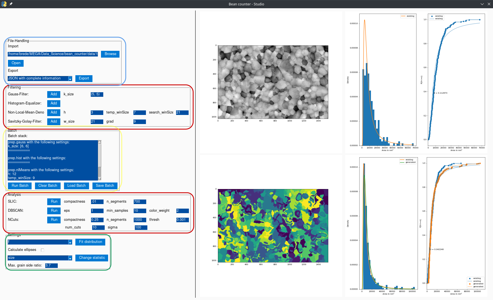
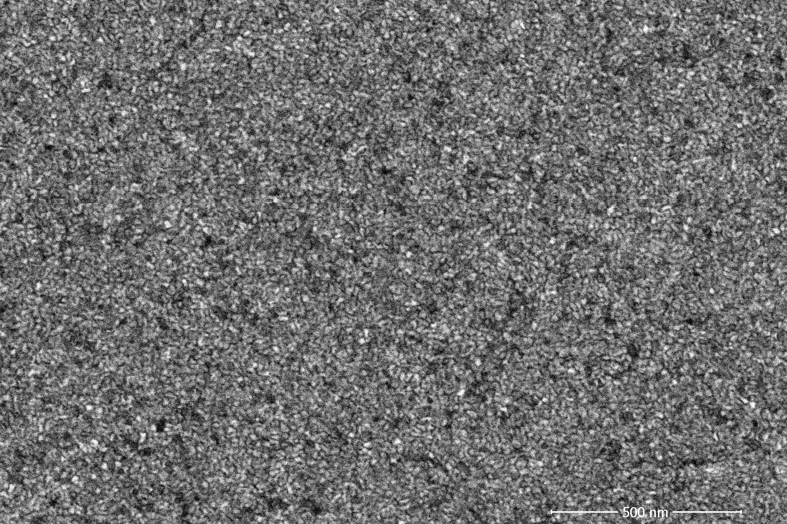

# Umsetzung und Entwicklung
Wie vom Institut für Materialforschung gefordert, wurde das Tool in der Programmiersprache Python umgesetzt. 
Im folgenden Kapitel wird anhand der grafischen Oberfläche auf eine Reihe von Umsetzungsaspekten eingegangen. Eine Reihe von Designentscheidungen ist im Prozess nach Rücksprache mit den Mitarbeitenden der Uni Göttingen entstanden, dies wird an entsprechender Stelle erwähnt.

Die GUI wurde mit `PySimpleGUI` [@pysimpleguiPySimpleGUIPythonGUIs] implementiert und exemplarisch im Einsatz für eine Kornauswerung in Abb. \@ref(fig:grainGUI) zu sehen. Links sind die Steuerelemente für Datenhandling, Vorverarbeitung, Analyse und GUI zu sehen, rechts die Bilder- und Kornverteilungen vor und nach der Analyse. 

Mit der Import-Schnittstelle im File-Handling-Segment (in Abb. \@ref(fig:grainGUI) blau umrandet) wird in einem Dialog der Pfad zu dem Kornbild angegeben, das geöffnet werden soll. Dieser Pfad wird dann, sollte er in '.tif' enden, mit Hilfe des OpenCV-Moduls [@OpencvpythonWrapperPackage] genutzt, um das gewählte Kornbild zu importieren. Beim Import werden die Datenfelder für die Höhe des Datenbalken und die Kantenlänge eines Pixels genutzt um zum Einen den Datenbalken auszublenden und zum Anderen den Umrechnungsfaktor von Pixelzahl in Fläche in $\mu m^2$ in einem dafür vorgesehenen Attribut des beim Öffnen initialisierten Kornbild-Objektes abzulegen. Zusätzlich wird im angegebenen Pfad nach einer `.csv`-Datei gesucht, die dieselbe Probenbeschreibung im Namen trägt, wie das `tif`-Bild. Sollte eine solche Datei vorliegen, wird sie mit Hilfe des `pandas`-Moduls[@PandasPowerfulPython2022] importiert und in einem dafür vorgesehen Attribut vorgehalten. Nach dem Import werden Kornbild und - wenn vorhanden - Korngrößenverteilungen außerdem rechts oben in der GUI mit Hilfe des `matplotlib`-Moduls[@MatplotlibMatplotlib2022] dargestellt.

Die Vorverarbeitungs- und Analysetools (in Abb. \@ref(fig:grainGUI) rot umrandet) sind beide nicht-statisch beim Programm-Start generiert. Dazu werden für beide Module mit Hilfe des `inspect`-Moduls alle Funktionen aufgelistet, die einer entsprechenden Namens-Konvention folgen. Deren Docstrings und Signaturen werden daraufhin ausgewertet, um Benennung und Argumentliste zu erstellen und als Text- und Input-Bausteine in die GUI einzufügen.

(ref:grainGUISubCap) GUI des Tools.

(ref:grainGUICap) GUI des Tools. Links sind die Steuer-Elemente, geteilt nach File-Handling, Bildvorverarbeitung, Analyse und generellen Einstellungen, rechts sind oben Bild vor Verarbeitung und händisch gemessene Korngrößen und unten das Bild nach Verarbeitung und gefundene Korngrößen im Vergleich mit den händisch gemessenen dargestellt.

```{r grainGUI, echo = F, fig.cap='(ref:grainGUICap)', fig.align='center',out.width=paste0(.96/1,'\\textwidth'), fig.show='hold', fig.scap='(ref:grainGUISubCap)'}

```

Die Vorverarbeitungsschritte werden bei Klick auf "Add" als Zeichenkette nach einem standardisierten Format an einen Parser übergeben, der als Teil des Kornbild-Moduls ein `dict` erstellt und dieses der Batch-Stack Liste hinzufügt. So wird zum Beispiel ein Gauss-Filter mit 5 Pixeln horizontaler und vertikaler Kernel-Größe als "`prep.gauss.(k_size=(5, 5))`" an den Parser übergeben und als "`{'category': 'prep', 'type': 'gauss', 'k_size': (5, 5)}`" zum Batch-Stapel hinzugefügt. Eine andere Methode des Kornbilds wird danach von der GUI aufgerufen, die den gesamten Batch-Stack in Menschen-lesbarer Form in der dafür vorgesehene Batch-Liste ausgibt (in Abb. \@ref(fig:grainGUI) gelb umrandet). Das Gauss-Filter Beispiel wird so zu dem Eintrag: 

"`prep.gauss with the following settings:
k_size: (5, 5)
`"

Die Schaltflächen unter der Batch-Liste erlauben, die erstellte Liste als JSON zu exportieren (`Save Batch`), aus einer JSON zu laden (`Load Batch`), alle Einträge zu löschen (`Clear Batch`) und den Stapel an Vorverarbeitungsschritten auszuführen (`Run Batch`). 
Die Ausführung ist dann so umgesetzt, dass die Listeneinträge iterativ an die zentrale Funktion des Vorverarbeitungsmodul weitergegeben werden. Hier wird der "type"-String im Aufrufs-`dict` genutzt um die richtige Funktion aufzurufen, die darauf folgenden Einträge werden der Funktion als `**kwargs` übergeben. Um neue Vorverarbeitungsmöglichkeiten anzufügen, muss dem Modul nur die Funktion hinzugefügt und der zentralen Funktion die Option eines neuen type-String hinzugefügt werden.
In der letzten Version sind die folgenden Vorverarbeitungsschritte implementiert:

* Savitzky-Golay-Filter in der Implementation aus dem scipy.signal-Modul [@ScipyScipy2022], so angepasst, dass das Polynom immer größer als das betrachtete Fenster und das Fenster immer eine ungerade Pixelgröße hat. Außerdem wird bei jeder Ausführung der Filter zweimal angewandt, einmal über die Bild-horizontale, dann über die Bild-vertikale,

* Histogram-Equalizer in der Implementation aus dem OpenCV-Modul [@OpencvpythonWrapperPackage],

* Gauss-Filter in der Implementation aus dem OpenCV-Modul [@OpencvpythonWrapperPackage], dabei um eine Überprüfung auf ungerade Pixelzahlen und entsprechender Anpassung in beiden Kernel-Dimensionen erweitert und

* Non-Local-Means-Denoiser in der Implementation aus dem OpenCV-Modul [@OpencvpythonWrapperPackage].

Diese vier Vorverarbeitungsschritte und ihre Implementationen wurden deswegen ausgewählt, weil sie bereits zur Vorbereitung des Linienschnitt-Verfahrens im Institut für Materialforschung eingesetzt wurden. Dabei wird bei allen Vorbereitungsschritten das für das modifizierte Bild vorgesehene Attribut als numpy-Array eingelesen, gefiltert und abschließend überschrieben. Durch das Setzen dieses Attributs auf das Originalbild vor jeder Durchführung der Vorverarbeitungsliste wird sichergestellt, dass keine vorausgegangenen Analyseschritte das Ergebnis beeinflussen.

Alle Analyse-Algorithmen wurden wieder über eine zentrale Funktion implementiert. Auch hier wird, wie im Fall der Vorverarbeitungs-Algorithmen, von der GUI ein String aus der Ausführungs-Aufforderung generiert, der nach der Umwandlung in ein `dict` an das Analyse-Modul weitergegeben wird, das nach dem "Type"-String die entsprechende Funktion aufruft. Genau wie im Vorverarbeitungsschritt wird hier auch das modifizierte Kornbild aus dem Kornbild-Objekt ausgelesen, weiterverarbeitet und wieder eingefügt.
Zur Analyse der Bilder wurde anfänglich nur DBSCAN aufgenommen, nach dem Test durch Studierende des Instituts für Materialphysik noch SLIC und eine Kombination von NCuts und vorangegangenem SLIC. 
Die Implementation des DBSCAN-Algorithmus erfolgte auf Basis des `scikit-learn cluster` Moduls [@ScikitlearnScikitlearn2022]. Damit die Analysen möglichst reibungslos erweitert werden können, wurden hier die objektorientierten Interfaces von `scikit-learn` genutzt, um möglichst in der Analyse-Funktion nur das Model-Objekt zu erstellen und alle darauffolgenden Verarbeitungsschritte in verallgemeinerten Funktionen zu verpacken, die dann die `fit_predict`-Methode des jeweiligen Modells aufrufen. 
Nach ersten Tests mit dem `DBSCAN`-Algorithmus stellte sich heraus, dass insbesondere für Bilder mit kleinen, regelmäßigen Kornmustern (für ein Beispiel siehe Abb. \@ref(fig:michelGrains)), die Möglichkeiten dieses Algorithmus an ihre Grenzen kommen. Um diesem Problem zu begegnen wurde der Funktionsumfang nach Besprechung der bei @stutzSuperpixelsEvaluationStateoftheart2018 diskutierten Superpixel-Methoden mit Mitarbeitern des Instituts für Materialforschung um `SLIC` und `Normalized Cuts` erweitert. Für beide Methoden wurde die Implementation aus dem `scikit-image`-Modul [@ScikitimageImageProcessing2022] genutzt, deren Interfaces aber leicht von den bisher genutzten `scikit-learn` Interfaces abweichen. Um die Analyse-Pipeline möglichst wenig anpassen zu mussen, wurde deshalb ein weiteres Modul geschrieben, dass je eine `NCuts`- und `SLIC`-Klasse anbietet, die die `fit_predict` Methode an die bisherige Pipeline angepasst anbietet. Die Anpassung bedeutete insbesondere, dass aus dem standardmäßig von `scikit-image` zurückgegebenen Bild-Matrizen eine Liste mit Cluster-Labeln wird, wie sie von `scikit-learn` beim Einsatz von Cluster-Methoden zurückgegeben wird.

(ref:michelGrainsSubCap) Kornbild mit besonders kleinen Strukturen.

(ref:michelGrainsCap) Kornbild mit besonders kleinen Strukturen. 

```{r michelGrains, echo = F, fig.cap='(ref:michelGrainsCap)', fig.align='center',out.width=paste0(.96/1,'\\textwidth'), fig.show='hold', fig.scap='(ref:michelGrainsSubCap)'}

```

Nach der Erstellung der Analyse-Modell-Objekte durch die Hilfsfunktionen werden so standardisiert bei allen Algorithmen Cluster-Labels generiert. Anschließend wird ein Post-Processing angestoßen, das eine Reihe von Beschreibungsgrößen berechnet, die von den Mitarbeitern der Uni Göttingen als hilfreich genannt wurden. Zum Einen sind das einfache Beschreibungen wie Anzahl an Pixeln, Größe des Clusters in $\mu m^2$, X- und Y-Koordinaten des Cluster-Mittelpunkts, die Varianz der Farbe der im Cluster befindlichen Pixel und der Durchmesser des Kreises, der der Fläche entsprechen würde. Außerdem wurde die Möglichkeit eingebaut, mit Hilfe des `scikit-image`-Moduls [@ScikitimageImageProcessing2022] Ellipsen an das Cluster anzupassen, deren Winkel und Länge der Haupotachse und Länge der kürzeren Achse auch ausgegeben werden. Da dieses Fitten aber computational vor allem für Bilder von kleinen Körnern aufwändig ist, wurde im "Settings"-Segment der GUI (in Abb. \@ref(fig:grainGUI) grün umrandet) ein Steuerungselement eingebaut, mit der diese Berechnung als Boolsches Attribut im Kornbild-Objekt unterdrückt werden kann.
Neben dieser Zusammenfassung wird nach erfolgreichem Durchlauf der Superpixel-Algorithmen außerdem ein Histogram und eine kumulierte Häufigkeitsverteilung der Korngrößen berechnet, an die außerdem per Maximum-Likelihood-Schätzung nach der Implementierung im scipy.stats-Modul [@ScipyScipy2022] eine Verteilungsfunktion angepasst wird. Die Klasse der Verteilungsfunktion, so wie die Auswahl der Korndurchmesser statt der -fläche können auf Wunsch der Mitarbeitenden auch im "Settings"-Segment der GUI ausgewählt werden. Verschiedene Funktionsklassen als Auswahlmöglichkeiten können hierbei als `dict` bei Programmstart angegeben werden, auch hier ist eine Erweiterung über den bisherigen Umfang also ohne großen Aufwand möglich.
Ein weiteres Ergebnis der Besprechungen mit der Uni Göttingen ist das `Max. grain side ratio`-Feld im `Settings`-Segment. Die vorherigen Versionen des Tools neigten, insbesondere bei Auswertung mit `DBSCAN`, zur Erstellung von Bildübergreifenden Clustern, die die Schatten an den Korngrenzen beinhalteten. Um diese Klassifikation nicht in die Ergebnisse einfließen zu lassen, kann mit dem Feld für das Maximale Seitenverhältnis aus den gefundenen Clustern die Menge herausgefiltert werden, die ein Seitenverhältnis größer als der angegebene Wert aufweisen. So kann über Vorwissen informiert eine Reihe von unmöglichen geometrischen Formen ausgeschlossen werden.

Die generierten Korn-Verteilungen werden dann rechts unten in der GUI dargestellt. Um die gefundenen Cluster deutlicher hervorzuheben, wird das Ergebnis statt in Grautönen wie bei dem eingelesenen und dann beim vor-verarbeiteten Bild in einer viridis-Farbskala präsentiert. Außerdem können die Ergebnisse und dazu berechneten deskriptiven Statistiken mit dem Export-Tool im File-Handling-Segment (in Abb. \@ref(fig:grainGUI) blau umrandet) exportiert werden. Dazu stehen der nutzenden Person zwei Export-Formate zur Auswahl - zum Einen eine CSV nur mit den deskriptiven Kornstatistiken, zum Anderen eine JSON mit zusätzlich Informationen über die vollzogene Vor-Verarbeitung und den Parametern der mit `scipy stats` angepassten Verteilung.